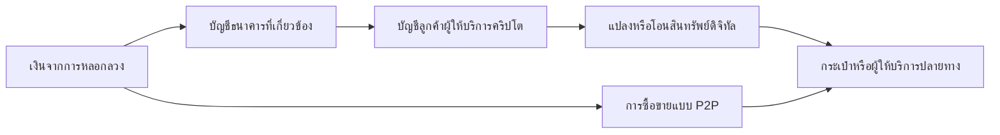

# บัญชีม้าคริปโต: ตัวเลข มาตรการ และช่องว่างที่ควรศึกษา

**ต่อยอด 28 ก.ย. 2569 — AI on-chain:** [ข้อเสนอและ problem statement](onchain-ai-opportunity.md), [หลักฐานและข้อจำกัด](onchain-ai-evidence.md), [ชุดพิสูจน์](onchain-ai-validation.md) มีเสียงสะท้อนจากผู้ใช้งานไทย แต่ยังไม่ยืนยันช่องว่างเหนือ copilot/agents ปัจจุบัน งานด้านล่างเป็นฐานวิจัยก่อนหน้า

**รอบต่อยอด 26 ก.ย. 2569:** อ่าน [ผลตรวจการชักชวนและมาตรการสามผู้ให้บริการ](provider-and-recruitment-audit.md) ก่อนเลือกแนวทาง พบว่ามีการถามบริบทการถอนอยู่แล้ว จึงยังไม่เลือกคำเตือน/แบบสอบถามทั่วไปเป็นผลิตภัณฑ์ใหม่ และแยกการป้องกันครั้งแรกออกจากการหยุดส่งต่อหลังรับเงิน พร้อม [หลักฐานรอบต่อยอด](provider-and-recruitment-evidence.md) และ [วิธีค้น](provider-and-recruitment-methods.md) เอกสารด้านล่างเป็นฐานรอบแรก

ค้นถึง 26 กันยายน 2569 · หัวข้อใหม่ แยกจากงานผลิตภัณฑ์บัญชีม้าเดิมที่พักไว้ · เอกสารสาธารณะเท่านั้น

**ข้อสรุป: เป็นช่องทางที่มีความเสี่ยงและกำลังยกระดับการกำกับ แต่ไม่ใช่พื้นที่ที่ยังไม่มีมาตรการ** ไทยมีมาตรฐานอุตสาหกรรมและมาตรการคัดกรอง/ระงับแล้ว ขณะนี้มีจุดเปลี่ยนสำคัญคือ Travel Rule ที่ออกแล้วแต่ยังไม่ถึงวันเริ่มใช้ และข้อเสนอคุม stablecoin เพิ่มเติมที่เพิ่งผ่านช่วงรับฟังความเห็น จึงควรศึกษา “ช่องว่างระหว่างตัวตน บัญชี และผู้รับประโยชน์จริงข้ามแพลตฟอร์ม” มากกว่าสรุปว่าขาดกฎหมายทั้งหมด

สถานะข้อสรุป: ยืนยันประกาศ/คำอธิบายของหน่วยงานได้ตามแหล่งด้านล่าง แต่ยังไม่มีข้อมูลรายบัญชีหรือผลประเมินเชิงเหตุเป็นผลว่ามาตรการใดลดการใช้ม้าได้เท่าไร แหล่งฉบับเต็มและข้อจำกัดอยู่ใน [ทะเบียนหลักฐาน](evidence.md)

## 1. ตัวเลขที่เห็นหมายถึงอะไร

| ช่วงข้อมูล | ตัวเลขที่รายงาน | หลักฐานและสถานะ |
|---|---|---|
| สะสมถึง 30 มิ.ย. 2568 | สกัดกั้นมากกว่า 29,000 บัญชี; สินทรัพย์อายัดประมาณ 186 ล้านบาท | ก.ล.ต. ข่าว 8 ส.ค. 2568 [C01](evidence.md) เป็นแหล่งต้นทางที่เจาะจงกว่าบทความ ธปท. ที่กล่าวถึงตัวเลขเดียวกัน |
| สิ้นปี 2568 | ระงับ 47,692 บัญชี | บทความ ก.ล.ต. 26 ม.ค. 2569 [C02](evidence.md) |
| สะสมถึงสิ้น มิ.ย. 2569 | ระงับ 60,968 บัญชี | ข่าวผู้จัดการ/ข่าวสด 14 ส.ค. 2569 อ้างรายงาน ก.ล.ต. [C03](evidence.md); รอบนี้ยังหาเอกสารสถิติต้นฉบับที่ยืนยันเลขนี้โดยตรงไม่พบ จึงเป็นตัวเลขผ่านสื่อ ไม่ใช่ยอดปัจจุบันที่ตรวจจากฐาน ก.ล.ต. แล้ว |

29,000 จึงไม่ใช่ตัวเลขถึงวันนี้ ส่วน 60,968 เป็นตัวเลขช่วงหลังที่พบในการค้นครั้งนี้ ไม่รับรองว่าเป็นยอดล่าสุดทั้งหมด ณ วันค้น

อย่าอ่านยอดสะสมว่าเป็นจำนวนผู้กระทำผิดที่ศาลตัดสินแล้ว จำนวนคนไม่ซ้ำ หรือจำนวนม้าที่เกิดใหม่ในช่วงนั้น และไม่เท่ากับยอดที่ยังถูกระงับอยู่ทั้งหมด ต้องทราบวิธีนับ การซ้ำข้ามผู้ให้บริการ และการปลดภายหลัง ตัวเลขที่เพิ่มอาจสะท้อนการตรวจพบ/ขยายรายชื่อ/การดำเนินงานเพิ่ม ไม่ได้พิสูจน์อุบัติการณ์เพิ่มในอัตราเดียวกัน สินทรัพย์อายัด 186 ล้านบาทไม่ใช่เงินคืนผู้เสียหายแล้ว

**ห้ามเอายอดระงับสะสมหารด้วย active traders รายเดือนเพื่อบอกสัดส่วนตลาดเป็นม้า:** ต่างทั้งช่วงเวลา หน่วยคน/บัญชี และฐานประชากร

## 2. “บัญชีม้าคริปโต” ไม่เท่ากับกระเป๋าคริปโตทุกใบ

แยกสามหน่วยก่อนวิเคราะห์:

- **บัญชีลูกค้าที่ผู้ให้บริการสินทรัพย์ดิจิทัล:** มีข้อมูลเปิดบัญชีและการให้บริการภายใต้อำนาจผู้ให้บริการ การระงับบัญชีในสถิติข้างต้นอยู่ในบริบทการจัดการของผู้ประกอบธุรกิจ ไม่ใช่การปิดทุก address บนบล็อกเชน
- **ที่อยู่บนบล็อกเชน / wallet:** เป็นหน่วยรับส่งสินทรัพย์ ไม่ใช่เลขประจำตัวบุคคล หนึ่งคนอาจเกี่ยวข้องหลายที่อยู่ การเห็นเส้นทางไม่ได้ทำให้รู้ชื่อหรือเจตนาโดยอัตโนมัติ ต้องเชื่อมกับข้อมูลที่ตรวจสอบได้
- **ผู้ควบคุมหรือผู้รับประโยชน์จริง:** อาจไม่ตรงกับชื่อผู้เปิดบัญชี และการที่เจ้าของมาช่วยทำรายการเองไม่เท่ากับถูกสวมรอยเสมอ ต้องแยกถูกหลอก ยินยอม ช่วยเพื่อน ถูกบังคับ และไม่ทราบ

ก.ล.ต. อธิบายตั้งแต่ พ.ค. 2568 ถึงการว่าจ้าง/หลอกเปิดบัญชีบน Exchange แล้วให้คนอื่นใช้ รวมถึงรับคริปโตแล้วส่งต่อ และแลกเงินผ่าน P2P [C04](evidence.md) ข้อมูลนี้ยืนยันว่ารูปแบบเป็นที่รับรู้แล้ว ไม่ใช่ผลสำรวจความถี่ของแต่ละรูปแบบ

เส้นทางตัวอย่างต่อไปนี้เป็นแผนภาพเชิงกลไก ไม่ใช่การสืบสวนคดีเฉพาะ และไม่หมายความว่าผู้เกี่ยวข้องทุกจุดรู้เห็น:

อีกเส้นทางคือเหยื่อใช้บัญชีคริปโตของตนซื้อและส่งสินทรัพย์ตามคำหลอก กรณีนี้ต้องตรวจข้อเท็จจริง ไม่ติดป้ายว่าเหยื่อเป็นผู้ขายบัญชีม้าเพียงเพราะเป็นผู้กดโอน การซื้อขาย P2P หรือใช้ self-hosted wallet เองก็ไม่ยืนยันการกระทำผิด

## 3. มาตรการมีถึงไหนแล้ว

| ชั้นมาตรการ | สิ่งที่ตรวจพบ | สถานะ ณ 26 ก.ย. 2569 / ข้อจำกัด |
|---|---|---|
| คัดกรองอุตสาหกรรม | ก.ล.ต./TDO/ผู้ประกอบธุรกิจจัดทำ Industry Standard เมื่อ 12 มี.ค. 2568 ครอบคลุมคัดกรองและจัดการบัญชีม้า | ดำเนินการแล้วตามรายงานหน่วยงาน [C01/C05]; ไม่ใช่พื้นที่ว่างด้านการตรวจบัญชี |
| กฎหมายและแลกเปลี่ยนข้อมูล | ก.ล.ต. อธิบายการแก้กฎหมายที่มีผล 13 เม.ย. 2568 ให้กลไกครอบคลุมสินทรัพย์ดิจิทัล การแลกข้อมูล/ระงับ และการจัดการผู้ให้บริการต่างประเทศที่เข้าข่ายให้บริการโดยไม่ได้รับอนุญาต | มีฐานมาตรการแล้ว [C04/C05]; รอบนี้อ่านคำอธิบายหน่วยงาน ไม่ใช้แทนการตรวจตัวบทสำหรับคดีเฉพาะ ไม่สรุปว่าปิดเว็บทำให้ธุรกรรมข้ามประเทศหยุดทั้งหมด |
| มาตรฐานเพื่อร่วมรับผิดชอบ | สธ. 22/2568 มีผล 13 ส.ค. 2568 ตามข่าว ก.ล.ต.; มี KYC/CDD และคัดกรองรายชื่อ โดยการร่วมรับผิดขึ้นกับการละเลยมาตรฐานและความเสียหายที่เกี่ยวข้อง | ใช้แล้วตามประกาศข่าว/คำอธิบาย [C01/C06]; ไม่ใช่การรับประกันชดใช้ทุกกรณี ตัว PDF ประกาศเข้าถึงไม่สำเร็จในการค้นนี้ |
| Travel Rule | รวบรวม/ส่งข้อมูลผู้โอนและผู้รับ ตรวจคู่ธุรกรรม/ผู้ให้บริการ และความเป็นเจ้าของหรืออำนาจควบคุม self-hosted wallet ตามเกณฑ์ | ออกเกณฑ์แล้ว; **เริ่มใช้ 27 ก.พ. 2570** ตามข่าว 2 ก.ย. 2569 [C07/C08] อย่าเขียนว่ามีผลใช้ครบแล้วหรือยังแค่รับฟังความคิดเห็น |
| กติกา stablecoin เพิ่มเติม | เสนอให้โอนเข้าออกกับบัญชี/กระเป๋าของลูกค้าเอง กรอบวงเงินและข้อยกเว้น รวมถึงธุรกรรมนอกแพลตฟอร์ม/MM/LP | ข่าว 3 ก.ย. เห็นชอบหลักการ; ข่าว 11 ก.ย. เปิดรับฟังถึง **25 ก.ย. 2569** [C09/C10] ยังไม่พบประกาศฉบับสุดท้าย/วันมีผลในรอบค้นนี้ จึงไม่ใช้ข้อเสนอเป็นกฎที่บังคับแล้ว |

Travel Rule ไม่ใช่ KYC ซ้ำ: KYC รู้จักลูกค้าที่เปิดบัญชี ส่วน Travel Rule เพิ่มข้อมูลคู่ธุรกรรมเมื่อโอนสินทรัพย์ คำอธิบาย ก.ล.ต. แยกการโอนเหรียญจากการซื้อขายบนกระดานและโอนเงินบาท และยอมรับว่าเรื่องข้อมูลไม่ครบ/กระเป๋าต้องตรวจเพิ่มอาจใช้เวลามากขึ้น [C08] เป็นภาระที่ต้องวัดจริง ไม่ใช่เหตุให้ตัดมาตรการออกทั้งหมด

## 4. ช่องว่างที่มีหลักฐานชี้ กับข้อสันนิษฐานของเรา

**ก. ความเชื่อมโยงข้ามแพลตฟอร์มและผู้ถือครองกระเป๋า — มีหลักฐานเชิงโครงสร้าง**

FATF รายงาน 3 มี.ค. 2569 ชี้ความเสี่ยง stablecoin ที่โอนระหว่าง unhosted wallets โดยไม่มีตัวกลางกำกับ และความยากของการควบคุมข้ามเครือข่าย [C11] อย่าสับสน P2P แบบไม่มีตัวกลางนี้กับตลาด P2P บน Exchange ซึ่งยังมีผู้ให้บริการเป็นส่วนหนึ่งของกระบวนการ การวิเคราะห์ความครอบคลุมต้องแยกสองแบบ

ข้ออนุมานสำหรับไทย: การสั่งผู้ให้บริการไทยหยุดบัญชีหนึ่งอาจไม่เพียงพอต่อสินทรัพย์ที่ออกไปแล้ว แต่ไม่ได้แปลว่าคริปโตติดตามหรือระงับไม่ได้เลย FATF กล่าวถึงบทบาทการประสานผู้มีอำนาจ/ผู้ออก stablecoin และเครื่องมือควบคุมตามเงื่อนไข ความเป็นไปได้ขึ้นกับสินทรัพย์ การควบคุม และอำนาจดำเนินการ ไม่ใช่ปุ่มย้อนโอนของทุกคน

**ข. รู้ว่าเจ้าของควบคุมกระเป๋าได้ แต่ยังไม่รู้ว่าใครสั่งให้ทำ — สมมติฐานที่ควรตรวจ**

การพิสูจน์ตัวตน/การควบคุมกระเป๋าไม่ได้พิสูจน์เจตนาหรือผู้รับประโยชน์สุดท้ายโดยตัวมันเอง คนที่ถูกชวนมาทำรายการเองอาจผ่านการยืนยันได้ ข้อเสนอนี้เป็นเหตุผลเชิงกลไกจากรูปแบบใน C04 ไม่ใช่หลักฐานว่ามาตรฐานปัจจุบันตรวจไม่พบคนกลุ่มนี้ทั้งหมด หรือว่าคำเตือนใหม่จะเปลี่ยนพฤติกรรมได้

**ค. ช่องว่างจากข้อมูลไม่ครบและการส่งต่อหลังพบความเสี่ยง — ยังไม่ทราบขนาดปัญหาจริง**

ข้อมูลบนเชนช่วยเห็นการเคลื่อนย้ายบางส่วน แต่ชื่อ/เจตนา/ประวัติบริการ/ผลคดีและข้อมูลภายในแพลตฟอร์มไม่ได้เปิดเผยตามมาทั้งหมด เราอาจสร้างการสาธิตจากข้อมูลสาธารณะได้ แต่ยังพิสูจน์ความแม่นยำการจับม้าหรือผลลดความเสียหายไม่ได้หากไม่มีผลยืนยันและกลุ่มเปรียบเทียบ

ต้องตรวจว่าเคสค้างที่ข้อมูลใด ใครมีสิทธิเติม ใครตัดสิน และหยุดความเสียหายทันหรือไม่ การกล่าวว่ามี CFR/Travel Rule ไม่พิสูจน์ว่าการปฏิบัติไร้ช่องว่าง แต่การอ่านไม่พบปัญหาก็ไม่พิสูจน์ว่ามีช่องตลาดให้เรา

## 5. ไม่ใช่ตลาดที่ไม่มีเครื่องมือ

Chainalysis KYT มีการตรวจธุรกรรม/แจ้งเตือน/จัดการเคส และ Notabene มีเครื่องมือพิสูจน์ self-hosted wallet [C12/C13] จึงไม่ควรถือว่า “ตาม wallet” หรือ “ยืนยันว่าเป็นกระเป๋าของใคร” เป็นความแตกต่างใหม่โดยลำพัง ข้อมูลจากผู้ขายยืนยันสิ่งที่เสนอขาย ไม่พิสูจน์ประสิทธิผลในไทยหรือความเหมาะสมกับทุกเกณฑ์ไทย

## 6. ประเด็นที่ควรคุ้ยต่อจากผลนี้

**แนะนำเจาะจังหวะที่เจ้าของบัญชีได้รับคำชักชวนให้รับเงิน/ซื้อคริปโต/โอนไปกระเป๋าภายนอก โดยเจ้าของยังเป็นคนทำรายการเอง** เพราะเป็นคำถามที่แยกจากการตามเงินและการยืนยันตัวตนตามปกติ แต่ยังต้องตรวจว่ากระบวนการเดิมป้องกันอยู่แล้วมากเพียงใด

สามคำถามที่สามารถทำวิจัยเอกสารต่อได้โดยยังไม่ต้องสร้างระบบ:

1. การชักชวนทำให้คนเข้าใจว่าตนเป็นลูกจ้าง ผู้ช่วยซื้อขาย นักลงทุน หรือผู้ให้ยืมบัญชีอย่างไร? แยกคำบอกเล่ากับคดีที่มีผลยืนยัน และไม่สรุปเจตนาจากโพสต์
2. ในขั้นตอนฝากเงินบาท–ซื้อ–โอนคริปโตออก ผู้ให้บริการมีจุดตรวจ/หน่วง/ถามวัตถุประสงค์/ส่งเจ้าหน้าที่อยู่แล้วที่ไหน? ต้องตรวจตามผู้ให้บริการจริง ไม่สร้างเกณฑ์ 24/72 ชั่วโมงแบบเหมารวมจากข่าวธนาคาร
3. ส่วนเสริมใดช่วยก่อนโอนออกได้มากกว่าวิธีเดิม โดยไม่รบกวนผู้ใช้ปกติ? ต้องวัดเหตุเสียหาย/การใช้ม้าที่ตรวจยืนยัน และผลกระทบต่อคนสุจริต ไม่ใช้จำนวนคำเตือนหรือการระงับเพิ่มเป็นผลสำเร็จเอง

นี่เป็นคำแนะนำให้เลือกประเด็นวิจัย ยังไม่เลือกผลิตภัณฑ์หรือผู้ซื้อ และไม่ย้ายข้อเสนอ S4 จากหัวข้อเดิมมาเป็นคำตอบอัตโนมัติ โจทย์ใหม่ที่รองรับได้คือ **“มาตรการครอบคลุมตัวตนและรายการมากขึ้นแล้ว แต่ยังต้องเข้าใจการชักชวนและผู้ที่ได้ประโยชน์จริง ณ จังหวะเงินเปลี่ยนเป็นคริปโต”** ไม่ใช่ “คริปโตไม่มีกฎรองรับ”

ดู [วิธีค้น ข้อจำกัด และการตรวจ](methods.md) สำหรับสิ่งที่ยืนยันไม่ได้ในรอบนี้
