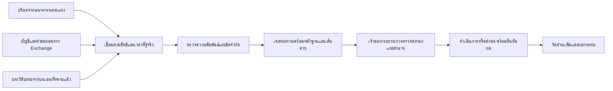

# CFR Pro Max — ชุดข้อเสนอ Storyboard และบทนำเสนอ

29 กันยายน 2569 · ฉบับเนื้อหาสำหรับตรวจแนวคิดก่อนสร้างจริง

สถานะ: มีข้อเสนอ แบบข้อมูล แผนพิสูจน์ และเรื่องเล่าบนกระดาษ ยังไม่มีแอป เดโมที่รันได้ ข้อมูลจำลองที่สร้างขึ้น ผลทดลองจริง หรือคำยืนยันผู้ซื้อ ชื่อ CFR Pro Max เป็นชื่อแนวคิดของงานนี้ ไม่ใช่ผลิตภัณฑ์ที่หน่วยงานรับรอง

ใช้ฉบับนี้เป็นเนื้อหานำเสนอที่ปรับจากรายงานหลักและ [รอบ 4](cfr-pro-max-round4-synthesis.md) รายละเอียดวิธีพิสูจน์อยู่ใน [ข้อกำหนดข้อมูลและการดำเนินการ](cfr-pro-max-validation-contract.md) และหลักฐานที่ตรวจเพิ่มอยู่ใน [ทะเบียนเพิ่มเติม](cfr-pro-max-evidence-update.md)

## 1. ข้อเสนอหนึ่งหน้า

**CFR Pro Max: เชื่อมความสัมพันธ์ก่อนเงินออกจากจุดที่ยังดำเนินการได้**

**ปัญหาที่ต้องพิสูจน์** — ในเส้นทางธนาคาร → Exchange → กระเป๋าคริปโต ความสัมพันธ์ที่ช่วยประเมินคำขอถอนอาจกระจายอยู่หลายองค์กร คำถามคือ เมื่อนำข้อมูลที่มีสิทธิใช้มาวิเคราะห์ร่วมตามเวลาที่รู้จริง จะพบความเสี่ยงเพิ่มเหนือระบบที่ใช้อยู่ และส่งหลักฐานให้ผู้รับผิดชอบดำเนินการทันได้หรือไม่

**ผู้ใช้** — เจ้าหน้าที่ความเสี่ยงและผู้ทบทวนคำขอถอนของ Exchange ร่วมกับทีมตรวจทุจริตของธนาคาร ผู้ใช้ผลลัพธ์และผู้มีอำนาจต้องระบุเป็นรายกระบวนการ ไม่ถือว่าทีมผู้พัฒนามีอำนาจพักเงินเอง

**วิธีทำงานที่เสนอ** — เชื่อมบริบทเงินเข้าหลายบัญชีผู้รับข้ามธนาคารกับบัญชีลูกค้าและคำขอถอนของหลาย Exchange เสริมด้วยประวัติปลายทางบนเชนที่ทราบแล้ว แสดงว่าความสัมพันธ์ใดเพิ่มความเสี่ยง การจับคู่เชื่อถือได้เพียงใด ข้อมูลส่วนใดขาด และเหลือเวลาเท่าไร จากนั้นส่งเคสไปยังผู้รับผิดชอบพร้อมติดตามผล

**สิ่งที่มีอยู่แล้ว** — ภาครัฐมีการแลกข้อมูลด้าน FX/stablecoin และวางระบบกลางเพื่อวิเคราะห์เครือข่าย ขณะเดียวกันผู้ขายมีเครื่องมือก่อนโอนอยู่แล้ว จึงต้องใช้สิ่งเหล่านี้เป็น baseline และหาเฉพาะส่วนเพิ่มที่ยังพิสูจน์ได้ [หลักฐาน E02 และรายงาน infra R03,R08–R10]

**สมมติฐานคุณค่า** — ความสัมพันธ์ข้ามหลายบัญชีและหลายองค์กรอาจทำให้จัดลำดับคำขอที่ควรทบทวนได้ดีขึ้น โดยข้อมูลมาถึงและคนตัดสินใจทันก่อนจุดที่หยุดไม่ได้ ความสัมพันธ์ไม่ได้ยืนยันความผิด และเคสสุจริตที่ดูเหมือนกันต้องอยู่ในการประเมินด้วย

**วิธีพิสูจน์** — Replay ตามเวลาที่ข้อมูลพร้อมใช้ เทียบระบบเดิม กฎร่วมแบบง่าย และวิธีวิเคราะห์เพิ่มเติม โดยแยกผลของความเร็ว วัดเคสที่พบทันเพิ่มพร้อมเคสที่พลาด ภาระเจ้าหน้าที่ coverage และเวลาที่ลูกค้าสุจริตถูกพัก การตรวจทันกับการดำเนินการทันเป็นคนละผล

**ขอบเขตที่ยังขาด** — สิทธิข้อมูล จุดสุดท้ายที่ Exchange หยุดได้จริง คุณภาพการจับคู่ ผลเหนือ baseline และความต้องการซื้อยังไม่ยืนยัน การพิสูจน์บนกระดาษตอบตรรกะได้ แต่ยังตอบความแม่นยำและมูลค่าประโยชน์จริงไม่ได้

**สิ่งที่จะขอในขั้นหารือถัดไป** — ให้เจ้าของข้อมูลและกระบวนการยืนยันข้อมูลขั้นต่ำ เวลา และ baseline เพื่อเลือก use case และรูปแบบการประเมินร่วม ไม่ขอข้อมูลส่วนบุคคลทั้งระบบตั้งแต่ต้น และยังไม่ได้ส่งคำขอนี้ถึงผู้ใด

## 2. ภาพการทำงานสำหรับอธิบายแนวคิด

ลูกศรเป็นข้อเสนอการไหลของข้อมูล ไม่ใช่การเชื่อมที่มีอยู่แล้ว สิทธิการเข้าถึง การเปลี่ยนสถานะ และความรับผิดชอบต้องกำหนดก่อนใช้จริง

ธนาคารอาจเห็นเส้นเงินก่อนฝาก Exchange ส่วน Exchange เห็นความผูกพันกับลูกค้าและคำขอถอน เชนให้ประวัติของที่อยู่ แต่ไม่ได้เปิด ledger ภายใน Exchange ทั้งหมด และการเห็น address ไม่ให้สิทธิควบคุม wallet ของผู้ใช้ [ข้อวิเคราะห์ประกอบหลักฐาน E05]

## 3. Storyboard ฉบับพร้อมใช้เขียนเดโมภายหลัง

### ข้อตกลงของเรื่องเล่า

ตัวละครทั้งหมดสมมติ: ธนาคาร A/B, Exchange X/Y, บัญชีรับเงิน a/b, ลูกค้า x/y, คำขอถอน wx/wy และปลายทาง d1/d2 ไม่ใช้ชื่อหรือ address ของบุคคลจริง ไม่ติดป้าย “ม้า” ให้ตัวละครจากรูปแบบเงินเพียงอย่างเดียว

เวลาเป็นตัวแปร: `t0` เหตุการณ์เริ่ม, `t1` มีคำขอ wx, `t2` มีคำขอ wy, `t3` ผู้วิเคราะห์ได้รับหลักฐานที่ต้องใช้ครบ, `D_x` และ `D_y` เป็นเส้นตายสมมติที่ยังหยุดแต่ละรายการได้ ไม่กำหนดนาทีจริงหรือรับรอง SLA

รหัส r1/r2 เป็นหลักฐานการจับคู่ที่สมมติให้เจ้าของข้อมูลยืนยันแล้ว ส่วนความสัมพันธ์ d1/d2 เป็นข้อมูลอดีตที่มีแหล่งและเวลาพร้อมใช้ โดย **ไม่มีป้ายเสี่ยงที่บังคับให้ baseline ต้องพักอยู่แล้วในเคสหลัก** หากมี ให้เล่าเป็นกรณีแยกในฉาก 7

| ฉาก | ภาพ/ข้อมูลที่แสดง | ข้อความเล่าเรื่อง | สิ่งที่ผู้ชมควรเข้าใจ |
|---|---|---|---|
| 1. มุมมองที่มีอยู่ | A เห็นเงินเข้า a และไป X; B เห็นเงินเข้า b และไป Y; X/Y เห็นลูกค้าของตนและคำขอถอน | “แต่ละฝ่ายมีข้อมูลและมาตรการของตนแล้ว เราต้องตรวจว่าความสัมพันธ์อะไรยังไม่อยู่ในมุมมองนั้น” | ไม่ตั้งว่าเดิมไม่มี analytics และไม่ประกาศว่าเคสผ่านกฎจริง |
| 2. ผูกเฉพาะสิ่งที่ยืนยันได้ | a ↔ x ↔ wx และ b ↔ y ↔ wy พร้อม r1/r2, source และเวลา | “เส้นนี้ยืนยันการจับคู่รายการตามสมมติฐาน ไม่ยืนยันเจตนาหรือที่มาของเหรียญทุกหน่วย” | แยก match confidence จาก risk |
| 3. ความสัมพันธ์ใหม่ | ที่ t3 มีเส้นเงินสองชุดและคำขอถอนที่สัมพันธ์กันผ่าน d1/d2 จากประวัติที่ทราบก่อนหน้า | “คำขอที่เห็นแยกกันมีบริบทเพิ่ม แต่ยังต้องเทียบกับกิจกรรมสุจริตและสิ่งที่ระบบเดิมรู้” | กลไกเกิดจากมุมมองร่วม; ไม่ใช้เหตุการณ์หลังถอน |
| 4. เทียบเงื่อนไข | A/A+/C1 ใช้ timeline เดียวกัน ระบุข้อมูลและกฎที่แต่ละแขนเห็น ช่องผลจริงยังว่าง | “ถ้ากฎร่วมง่ายช่วยได้พอ ก็ไม่จำเป็นต้องเพิ่ม AI” | ความซับซ้อนไม่ใช่ความสำเร็จ; ไม่มีตัวเลข accuracy ที่แต่งขึ้น |
| 5. ส่งทบทวน | การ์ดคำขอ wy พร้อมหลักฐาน เวลา coverage และผู้รับผิดชอบ มีลำดับ sent → ack → reviewed → action-confirmed | “ส่งถึงไม่เท่ากับพักได้ ต้องตรวจสถานะและอำนาจตอนดำเนินการ” | นับทันเฉพาะ action ก่อน D_y ที่ยืนยันได้ |
| 6. คนสุจริตที่เหมือนกัน | ลูกค้าหลายรายใช้บริการเดียวกัน มีรูปแบบเงินและเวลาคล้ายเคสหลัก | “หากข้อมูลที่เห็นเหมือนกัน ระบบยังแยกเจตนาไม่ได้ ต้องแสดงความไม่แน่นอนและต้นทุนทบทวน” | ไม่ทำ benign case ให้ง่ายด้วยการเอาการถอนคริปโตออก |
| 7. เดิมจับได้อยู่แล้ว | เพิ่มป้ายเสี่ยงที่ baseline รู้ก่อน t0 และบันทึกเดิมพัก wy | “กรณีนี้ไม่นับการพักเป็นผลงานเพิ่มของเรา” | baseline เข้มแข็งและไม่ double-count |
| 8. ช่วยได้ไม่ครบเวลา | แตกสองทาง: t3 เกิน D_x แต่ยังไม่เกิน D_y / หรือ t3 เกินทั้งคู่ | “อาจช่วยรายการถัดไปได้ แต่ไม่ป้องกันรายการที่ผ่านจุดดำเนินการไปแล้ว” | ขอบเขตเวลาเป็นรายคำขอ ไม่ใช่รายเครือข่ายเหมารวม |
| 9. แก้ข้อมูลและ coverage | r2 ถูกแก้, ฟีดหนึ่งขาด, ปลายทางบริการร่วม หรือ P2P/offshore ไม่อยู่ในขอบเขต | “ถอนข้อสรุปที่พึ่งหลักฐานผิดและบอกจุดที่มองไม่เห็น” | ไม่เดาเติมเส้น; การหมดอายุสัญญาณไม่ปลด hold อื่น |
| 10. สิ่งที่ยังต้องวัด | ตาราง timely detection, action, coverage, precision, ภาระคน, เวลาพักสุจริต ระบุ ‘ยังไม่มีผลจริง’ | “สิ่งที่แสดงคือวิธีพิสูจน์ ผลจริงต้องมาจากข้อมูลและกระบวนการที่ได้รับอนุญาต” | เดโมในอนาคตพิสูจน์ logic ได้ ไม่ใช่ market fit หรือเงินที่ช่วยได้ |

### ตัวอย่างเนื้อหาการ์ดเคสที่เสนอ

**คำขอที่ต้องทบทวน:** wy · Exchange Y · เวอร์ชันสถานะล่าสุดที่ทราบ

**เหตุผลที่บริบทเพิ่ม:** มีความสัมพันธ์ระหว่างคำขอจาก X/Y และบริบทแหล่งเงินหลายบัญชี ซึ่งต้องตรวจเทียบกับข้อมูลเดิมและกิจกรรมสุจริต

**หลักฐานการจับคู่:** r2 พร้อมเจ้าของข้อมูลและเวลา · **หลักฐานความสัมพันธ์:** ประวัติ d1/d2 ที่พร้อมใช้แล้ว · **สิ่งที่ยังไม่รู้:** ผู้ควบคุมปลายทาง เจตนาของลูกค้า และส่วนของยอดถอนที่สัมพันธ์กับแต่ละเงินฝาก

**เวลาที่รู้:** t3 · **เส้นตายสมมติ:** D_y · **coverage:** องค์กรและช่วงเวลาที่มีข้อมูล · **ผู้รับผิดชอบ:** หน่วยงานภายใน Y ตามสิทธิ · **สถานะ:** รอทบทวน ไม่ใช่ข้อยืนยันว่าผิด

**ตัวเลือกของเจ้าของกระบวนการ:** ตรวจข้อมูลเพิ่ม / ไม่มีการยกระดับเพิ่ม / พักตามอำนาจและนโยบาย / ส่งต่องานติดตาม หากรายการพ้นจุดดำเนินการแล้ว การออกแบบ UI จริงยังไม่เริ่ม

## 4. บทนำเสนอพร้อมใช้เป็นร่างคำพูด

แต่ละช่วงเป็นเนื้อหาสำหรับนำไปจัดสไลด์ภายหลัง ยังไม่มีไฟล์สไลด์ ไม่กำหนดระยะพูดจนทราบกติกาปัจจุบัน

### ช่วง 1 — คำถามที่เราอยากตอบ

“ถ้าธนาคารเห็นเส้นเงินก่อนเข้าบัญชีลูกค้า Exchange ส่วน Exchange เห็นคำขอถอน และ blockchain ให้ประวัติปลายทาง ข้อมูลที่แต่ละฝ่ายมีอยู่จะช่วยกันประเมินคำขอได้ดีกว่าเดิมหรือไม่ โดยต้องรู้เร็วพอให้ผู้รับผิดชอบดำเนินการทัน นี่คือสมมติฐานของ CFR Pro Max”

ภาพประกอบที่เสนอ: เส้นทางสามช่วงพร้อมนาฬิกาแสดง ‘ข้อมูลพร้อมใช้’ และ ‘จุดสุดท้ายที่ดำเนินการได้’ ไม่มีตัวเลขผลจริง

### ช่วง 2 — เริ่มจากระบบที่มีอยู่แล้ว

“วันนี้ภาครัฐมีการแลกข้อมูลด้านสินทรัพย์ดิจิทัล และกำลังออกแบบระบบกลางเพื่อวิเคราะห์เครือข่าย ผู้ขายก็มีเครื่องมือก่อนโอนอยู่แล้ว งานของเราคือระบุส่วนที่ยังต้องพิสูจน์ ณ รอยต่อธนาคารกับคำขอถอน แล้วเปรียบเทียบกับความสามารถจริงเหล่านั้น”

หลักฐานบนสไลด์ในอนาคต: หน้า ธปท. ตาม E02, ข่าวรัฐบาลในรายงาน infra R08 และ Notabene R03 ไม่วาดเครื่องหมายว่าแต่ละราย “ไม่มี” ความสามารถที่ยังหาเอกสารไม่พบ

### ช่วง 3 — ความสัมพันธ์ที่อาจเพิ่มคุณค่า

“ลองดูคำขอจากลูกค้าคนละ Exchange แต่ละคำขอมีบริบทของตน เมื่อเชื่อมข้อมูลที่ได้รับอนุญาต เราอาจเห็นความสัมพันธ์ระหว่างหลายเส้นเงินและปลายทางพร้อมกัน สิ่งที่เพิ่มคือบริบทสำหรับทบทวน ยังไม่ใช่หลักฐานว่าคนเหล่านั้นเป็นม้า”

ภาพประกอบ: ฉาก 1–3 พร้อมป้าย ‘สถานการณ์สมมติ’ และแยกเส้นที่เจ้าของข้อมูลยืนยันจากความสัมพันธ์ที่ยังเป็นข้ออนุมาน

### ช่วง 4 — ผลลัพธ์ที่เจ้าหน้าที่ต้องใช้ได้

“เราเสนอให้ส่งเคสที่บอกว่าความสัมพันธ์ใดทำให้ควรตรวจเพิ่ม ข้อมูลนั้นมาจากไหน เชื่อมได้มั่นใจเพียงใด และยังมีเวลาหรือไม่ ผู้มีอำนาจที่ Exchange ตรวจสถานะแล้วตัดสินใจ การตอบรับข้อความไม่ถือว่าพักสำเร็จ และเราไม่อ้างว่าควบคุมทุก wallet ได้”

ภาพประกอบ: การ์ด wy และลำดับรับเรื่อง–ทบทวน–ยืนยันผล ไม่แสดงปุ่มที่สื่อว่าทีมสั่งอายัดได้เอง

### ช่วง 5 — วิธีพิสูจน์ให้ยอมแพ้ได้ด้วย

“เราจะเปรียบเทียบระบบเดิมกับการใช้ข้อมูลร่วมด้วยกฎง่าย และค่อยประเมินวิธีที่ซับซ้อนขึ้น แยกผลของความเร็วออกจากการเห็นข้อมูลเพิ่ม วัดทั้งเคสที่พบทันและเคสที่พลาด โดยคิดภาระเจ้าหน้าที่และเวลาที่คนสุจริตถูกพักด้วย ถ้าวิธีง่ายได้ผลเท่ากัน เราจะใช้วิธีง่าย”

ภาพประกอบ: ตารางแขนทดลองใน validation contract ผลลัพธ์ยังว่าง ไม่ใช้ตัวเลขของ Hertha/Aurora เป็นผลคาดการณ์ผลิตภัณฑ์

### ช่วง 6 — เคสที่ต้องยอมรับว่าช่วยไม่ได้

“ถ้าคนสุจริตและกรณีผิดมีข้อมูลที่เห็นเหมือนกัน เราต้องยอมรับว่าแยกไม่ได้จากข้อมูลชุดนั้น ถ้าหลักฐานมาหลังเส้นตายก็ไม่นับว่าป้องกันรายการเดิมได้ และถ้าระบบเดิมพักอยู่แล้วก็ไม่นับเป็นผลงานเพิ่ม ข้อจำกัดเหล่านี้อยู่ในแผนพิสูจน์ตั้งแต่ต้น”

ภาพประกอบ: ฉาก 6–9 แสดง missed deadline, shared service และ corrected mapping อย่างละหนึ่งกรณี

### ช่วง 7 — สถานะและขั้นถัดไป

“ตอนนี้เรามีข้อเสนอ แบบข้อมูล และแผนประเมิน ยังไม่มีผลทดสอบกับข้อมูลจริง ขั้นถัดไปคือยืนยันข้อมูลขั้นต่ำ จุดดำเนินการ และ baseline กับเจ้าของระบบก่อนเลือกขอบเขตทดลอง ถ้าผลเพิ่มไม่คุ้ม เราจะปรับหรือหยุด use case นั้น การมีคนพร้อมซื้อก็ต้องพิสูจน์แยกจากความเป็นไปได้ทางเทคนิค”

ภาพประกอบ: gate ข้อมูล → เวลา/อำนาจ → ส่วนเพิ่ม/ผลกระทบ → ความคุ้มค่า/ผู้ซื้อ แสดงสถานะ ‘ยังไม่ผ่านการทดสอบจริง’

## 5. คำตอบสั้นสำหรับคำถามที่เลี่ยงไม่ได้

| คำถาม | คำตอบที่ใช้ได้ |
|---|---|
| ต่างจาก CFR อย่างไร | “เรากำลังทดสอบส่วนเพิ่มของข้อมูลและความสัมพันธ์ที่ไปถึงคำขอถอนทันเวลา ต้องเทียบกับ CFR และเครื่องมือปัจจุบันก่อน ยังไม่อ้างว่าขาดความสามารถนี้แน่นอน” |
| Travel Rule ทำแทนแล้วหรือไม่ | “ช่วยเรื่องข้อมูลคู่ธุรกรรม แต่ Q&A ก.ล.ต. แยกออกจากการซื้อขายบนกระดานและเงินบาท จึงต้องตรวจการเชื่อมทั้งเส้นทางเพิ่มเติม ทั้งนี้ไม่ได้แปลว่าผู้ขายเดิมทำเพิ่มไม่ได้” [E01] |
| ต้องใช้ AI หรือไม่ | “ยังไม่จำเป็น ถ้ากฎร่วมง่ายให้ผลและภาระที่เหมาะสม ก็เป็นผลสำเร็จของกลไกได้” |
| หยุดเงินได้เท่าไร | “ยังไม่มีผลจริง เงินที่พักยังไม่เท่ากับเงินที่ช่วยหรือคืนได้ เราจึงยังไม่ให้ตัวเลข” |
| ทำไมไม่ซื้อเครื่องมือเดิม | “เป็นทางเลือกหลักที่ต้องเทียบ หากต่อยอดได้คุ้มกว่าก็ควรใช้ เราต้องพิสูจน์ส่วนที่ยังขาดก่อน” |
| ข้อมูลมาจากไหน | “ต้องมาจากเจ้าของข้อมูลตามสิทธิที่ตกลง ไม่อนุมานว่าทีมมีสิทธิเพราะมี API หรือกฎหมายกำหนดหน้าที่ของผู้ประกอบธุรกิจ” |
| ใช้หนึ่งธนาคารกับหนึ่ง Exchange พิสูจน์ได้ไหม | “ใช้ตรวจ mapping และ workflow ได้ แต่ยังไม่พิสูจน์ประโยชน์ข้ามหลายองค์กร ต้องรายงานระดับการพิสูจน์ให้ตรงขอบเขต” |
| ถ้าระบบรัฐทำเหมือนกันแล้ว | “ให้ใช้ระบบนั้นเป็น baseline แล้ววัดส่วนเพิ่มและต้นทุน หากไม่เพิ่มก็ไม่ควรทำซ้ำ” |

## 6. ถ้อยคำที่แก้จากเนื้อหาเดิม

| เลิกใช้ | ใช้แทน |
|---|---|
| “ข้อมูลเดิม แค่ต่อกันก็หยุดเงินได้” | “ข้อมูลร่วมอาจเพิ่มบริบท ต้องพิสูจน์ว่าพบทันและดำเนินการทัน” |
| “แต่ละฝ่ายเห็นต่ำกว่าเกณฑ์” โดยไม่ระบุสมมติ | “ตัวอย่างสมมติ; baseline จริงและ threshold ยังต้องตรวจ” |
| “ทราบว่าเป็นเหยื่อเพราะใช้บัญชีตนเอง” | “บทบาทยังไม่ทราบจากธุรกรรมเพียงอย่างเดียว” |
| “ปลายทางร่วมคือเครือข่ายม้า” | “มีความสัมพันธ์ซึ่งต้องแยกบริการร่วมและคำอธิบายสุจริต” |
| “รับทราบสัญญาณแล้วจึงพักสำเร็จ” | “ต้องมีผลดำเนินการที่ Exchange ยืนยันและทันเส้นตาย” |
| “ระบบกลางมีฟีเจอร์แล้วจึงเหลือทำชุดวัดผล” | “ต้องเทียบผลและต้นทุนก่อนเลือกบทบาทที่ยังมีคุณค่า” |
| “มีเดโมข้อมูลสังเคราะห์แล้ว” | “มี Storyboard บนกระดาษ ยังไม่สร้างเดโม” |

## 7. ทางเลือกธุรกิจและบริบทการแข่งขันที่ใช้กับชุดนี้

คำตัดสินด้านธุรกิจคงตาม [ผลประเมิน infra ส่วน 3–4](cfr-pro-max-infra-assessment.md): ยังไม่จัด connector ทั่วไปเป็นอันดับหนึ่ง ให้ศึกษาการวิเคราะห์ร่วมและเส้นทางส่งหลักฐานสู่ผู้ดำเนินการ รวมทางเลือกต่อยอดผู้ขายเดิม งานจ้างเฉพาะรอยต่อ หรือโครงการร่วม โดยไม่สมมติผู้ซื้อ/ราคา

จำนวน Exchange ที่ได้จากทะเบียนเป็นขอบเขตผู้เล่น ไม่ใช่ยอดขาย การพิสูจน์คุณค่าต้องคิดค่าบำรุงรักษาและผลกระทบรายองค์กร ข้อมูลตลาดมหภาคใช้ยืนยันความสำคัญของปัญหา ไม่ใช้คำนวณรายได้ตรง ๆ

ชุดนี้ยังไม่สมมติว่าได้รับอนุญาตเปลี่ยนแทร็กหรือไอเดีย หากยังอยู่ Track 2 ต้องใช้เฉพาะส่วนที่ตอบปัญหาการเข้าถึงของผู้ใช้เดิมและมีหลักฐานจริง เกณฑ์ 30/30/20/20 ที่มีเป็นรอบคัดเลือก 15 ทีม ไม่ใช่เกณฑ์ Final ที่ยืนยันแล้ว ดูเอกสารบริบทโครงการและรายงาน infra ส่วน 5

## 8. ตรวจความครบเทียบงานที่ส่งต่อ

| งานตาม prompt A–G | หลักฐานงานที่ทำเสร็จ | ข้อจำกัดที่เปิดไว้ |
|---|---|---|
| A. สมมติฐานข้อมูลหกชั้น | validation contract ส่วน 2 | ไม่มีผลจริงของคู่ทดลอง |
| B. ห้าคำถามสถานะปัจจุบัน | infra ส่วน 2 และ evidence-update E01–E04 | schema รายองค์กร, T_stop, TOR ยังไม่ยืนยัน |
| C. เคสหลายองค์กรและกรณีท้าทาย | Storyboard ส่วน 3 และ P01–P16 ใน contract | เป็นการตรวจตรรกะ ไม่ใช่ accuracy |
| D. ข้อมูล สถาปัตยกรรม สิทธิ เวลา และการแก้ไข | แผนภาพส่วน 2 และ contract ส่วน 3–4 | ชื่อ field/ขั้นตอนเป็นข้อเสนอ ยังไม่ใช่มาตรฐานจริง |
| E. baseline/replay/labels/metrics/gates | contract ส่วน 5–7 | ยังไม่กำหนด threshold เชิงธุรกิจแทนผู้ปฏิบัติงาน และยังไม่รัน |
| F. ทางเลือกผลิตภัณฑ์/ธุรกิจ/ผู้ขาย | infra ส่วน 3–4 และส่วน 7 ของชุดนี้ | ราคาจริง ความต้องการซื้อ และข้อกฎหมายรายมาตรายังค้างยืนยัน |
| G. ข้อเสนอ Storyboard และโครงเรื่อง pitch | ส่วน 1, 3, 4 พร้อมคำพูด | เสร็จระดับเนื้อหาตามขอบเขตที่ขอ |
| ข้อคัดค้าน/แหล่ง/งานถัดไป | infra ส่วน 6,8,9; evidence-update ส่วน 4; contract ส่วน 7 | ไม่มีการติดต่อหรือเริ่มทดลอง |

**ผลที่พร้อมตรวจ:** เนื้อหาทั้งสามอย่างและข้อกำหนดการพิสูจน์เชื่อมกันได้ โดยไม่ใช้ข้อมูลอนาคต ไม่รับรองการจับผิดจากกราฟ และไม่อ้างผลผลิตภัณฑ์ที่ยังไม่เกิด สิ่งที่ค้างเป็นการยืนยันกับข้อมูล กระบวนการ และผู้ซื้อจริง ไม่ใช่การเขียนเนื้อหาส่วนที่หายไป

| ระดับคำตัดสิน | สถานะหลังทำเนื้อหาชุดนี้ |
|---|---|
| แนวคิดมีเหตุผลให้ศึกษา | มีเหตุผลแบบมีเงื่อนไข แต่ยังไม่พิสูจน์ว่าข้อมูลเป้าหมายเพียงพอ |
| กลไกบนกระดาษ | ตรวจความสอดคล้องของเวลา ข้อมูล และข้อจำกัดแล้ว ไม่ใช่ผลรันระบบ |
| พร้อมทดลองข้อมูลจริง | ยังไม่พร้อมจนยืนยันสิทธิ ข้อมูล baseline และจุดดำเนินการ |
| พร้อมเป็นผลิตภัณฑ์ | ยังไม่ผ่านผลตรวจจริง ผลกระทบ และต้นทุน |
| มีคนพร้อมซื้อ | ยังไม่มีหลักฐานยืนยัน |
