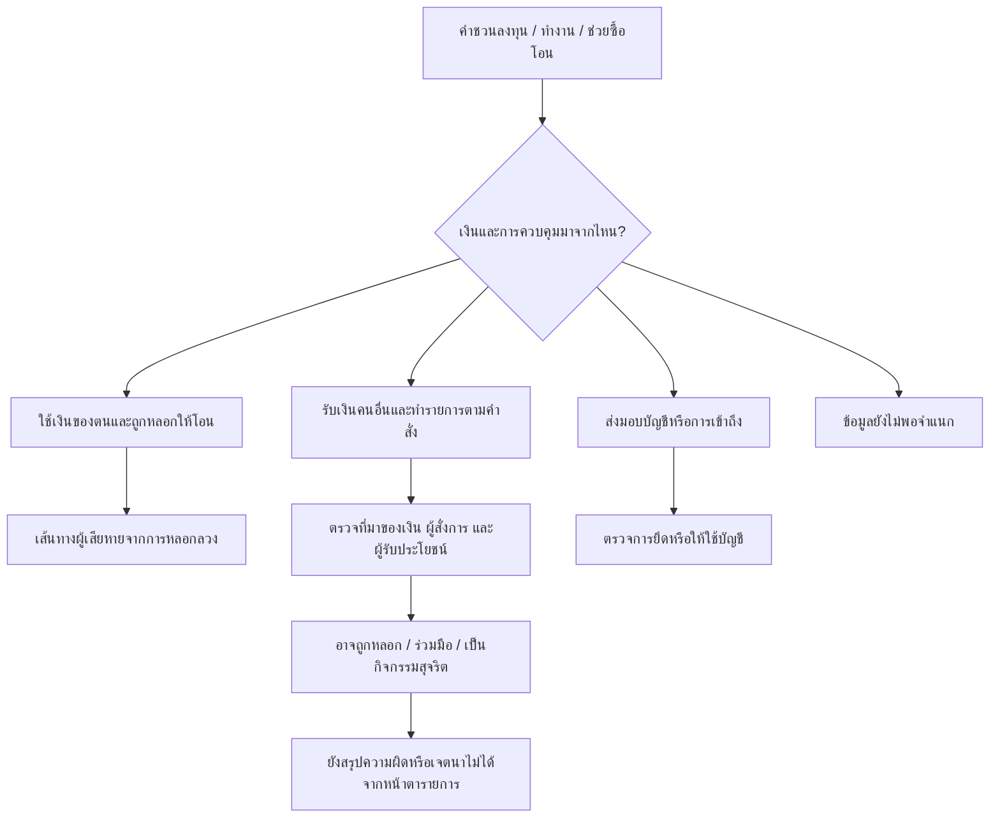

# การชักชวนให้เจ้าของทำรายการเอง: มีปัญหาอะไรเหลือหลังมาตรการเดิม?

วันที่ตรวจ 26 กันยายน 2569 · ต่อจาก [รายงานรอบแรก](README.md) · อ่านคู่กับ [ทะเบียนหลักฐานรอบนี้](provider-and-recruitment-evidence.md) และ [วิธีค้น](provider-and-recruitment-methods.md)

**ข้อสรุป: มีเหตุผลให้ศึกษาการรับงานซื้อและโอนคริปโตแทนคนอื่นต่อ แต่ยังไม่มีหลักฐานพอเลือกเป็นผลิตภัณฑ์หรือยืนยันว่าจะลดบัญชีม้าได้** หลักฐานใหม่หักล้างสมมติฐานว่า “ผู้ให้บริการตรวจเพียงตัวตน จึงต้องเพิ่มคำถามก่อนถอน”: อย่างน้อย Binance TH เปิดเผยขั้นตอนตรวจเหตุหลอกลวงและถามวัตถุประสงค์แล้ว ขณะเดียวกันมีรายงานการสังเกตประกาศรับคนให้ใช้บัญชีตนเองทำรายการ แต่ยังไม่ทราบว่ามีกี่คนทำสำเร็จ เงินเป็นของใคร และกระบวนการเดิมหยุดได้กี่กรณี

## 1. สิ่งที่หลักฐานใหม่เปลี่ยน

1. **การถามเหตุผลก่อนถอนมีอยู่แล้ว** FAQ ของ Binance TH ลงวันที่ 28 พ.ค. 2569 ระบุการเตือนตามความเสี่ยง การติดต่อเจ้าหน้าที่ซึ่งอาจขอแบบสอบถามและวัตถุประสงค์ รวมถึงการขอทบทวนเมื่อถูกระบุผิด ดังนั้น “คำเตือน + แบบสอบถาม + เจ้าหน้าที่” ยังไม่ใช่ความแตกต่างของผลิตภัณฑ์เรา [P01]
2. **การตรวจไม่ได้หยุดแค่บัตรประชาชน** เอกสารเพิ่มวงเงินของ Binance TH ครอบคลุมแหล่งรายได้และเอกสารการเงิน ส่วน Bitkub มีประกาศจำกัดการถอนบัญชีใหม่ระหว่างรอตรวจเพิ่มเติมตั้งแต่ปี 2568 การอ้างว่าเปิดง่ายแล้วถอนได้ทันทีทุกแห่งไม่ตรงกับหลักฐานที่พบ [P02/P04]
3. **มีเบาะแสการขายแรงงานทำรายการ แทนการส่งมอบบัญชีอย่างเดียว** TCIJ/Prachatai รายงานประกาศในเดือน มี.ค. 2569 ให้คนใช้บัญชีของตนซื้อและโอน USDT เพื่อค่าตอบแทน แต่ผู้รายงานเองยังไม่ยืนยันความผิดจากประกาศนั้น เราไม่ได้เข้ากลุ่มหรือยืนยันการซื้อขายสำเร็จ [R01]
4. **การชักชวนเกี่ยวกับคริปโตไม่เท่ากับบัญชีม้าทุกกรณี** คำเตือนตำรวจสิงคโปร์มีกรณีหลอกให้เหยื่อซื้อและโอนคริปโตจากการชวนลงทุน/ทำงาน ขณะที่ข่าวดำเนินคดี P2P อีกฉบับกล่าวถึงทรัพย์ที่เชื่อมกับผู้เสียหายคนอื่น ต้องแยกสองกลไกนี้ก่อนวัดผล [R02/R03]

รหัสในรายงานเชื่อมกลับไปแหล่ง วันที่ และสถานะในทะเบียนหลักฐาน ไม่ใช้การมีประกาศเป็นผลประเมินประสิทธิผล

## 2. ตารางมาตรการสาธารณะของผู้ให้บริการไทย

เป็นการตรวจเอกสาร ไม่ใช่การสมัครบัญชีหรือทดสอบแอปจริง วันที่หน้าเว็บไม่รับรองว่ารายละเอียดทั้งหมดเหมือนกระบวนการภายในปัจจุบัน การค้นรายละเอียดไม่พบไม่แปลว่าไม่มีมาตรการ

| ช่วง / ประเด็น | Binance TH | Bitkub Exchange | orbix Trade |
|---|---|---|---|
| ก่อนถอน / บัญชีใหม่ | ประกาศ 6 ก.พ. 2568 จำกัดถอนของบัญชีใหม่ที่เข้าเกณฑ์จนตรวจเพิ่มเติม [P03]; ใช้เป็นประวัติมาตรการ | ประกาศแคมเปญ 12 เม.ย. 2568 อธิบายมาตรการที่เริ่ม 3 ก.พ. 2568 [P04]; ไม่ถือว่าเป็นคู่มือปัจจุบันครบชุด | รอบนี้ยังไม่ได้เอกสารบัญชีใหม่ที่ละเอียดพอเทียบกัน |
| แหล่งเงิน / วงเงิน | คู่มือ KYC Upgrade ให้ส่งเอกสารรายได้และการเงิน; ระหว่างรอตรวจยังฝากและซื้อขายได้ตามที่หน้าระบุ [P02] | พบเอกสารเพิ่มวงเงินในผลค้นทางการ แต่เปิดหน้าไม่ได้ จึงใช้เป็นเบาะแสเท่านั้น [P05] | ประกาศ 11 ต.ค. 2567 ให้ติดต่อเจ้าหน้าที่เพื่อยืนยันข้อมูลการถอนมูลค่าสูง [P06] |
| ก่อนถอนที่มีสัญญาณเสี่ยง | พบเอกสารอธิบายการเตือน/ระงับและตรวจเหตุถอน ไม่เปิดเผยคำถามทั้งหมดหรืออัตราตรวจผิด [P01] | ยังยืนยันรายละเอียดคำถามหรือการส่งต่อในขั้นถอนจากหน้าที่เข้าถึงไม่ได้ | ยังยืนยันรายละเอียดคำถามจากเอกสารสาธารณะที่อ่านไม่ได้; การมีเจ้าหน้าที่ไม่พิสูจน์ว่าถามเจตนาแบบใด |
| การควบคุมปลายทาง / ยืนยันรายการ | มี whitelist ที่ผู้ใช้เปิดได้; การจำกัด 24 ชั่วโมงผูกกับการปิดฟังก์ชัน ไม่ใช่ทุกการถอน [P07] | ไม่ได้ตรวจครบในรอบนี้ | คู่มือ 15 ก.ย. 2568 ระบุ address/network และยืนยันด้วยใบหน้าในแอป ส่วนเว็บมีอีเมลยืนยัน; ไม่ได้พิสูจน์ว่าเจ้าของปลายทางมีเจตนาใด [P08] |
| ผู้สุจริต / ทบทวน | FAQ ระบุส่งหลักฐานขอทบทวนผ่าน Customer Service [P01] | มีช่องทาง support แต่ยังไม่มีข้อมูลรอบนี้พอระบุ SLA หรือเกณฑ์คืนสิทธิ | P06 ระบุช่องทาง support/live chat; ไม่พบ SLA ทบทวนจากแหล่งนี้ |
| ประสิทธิผล / ภาระจริง | ไม่พบผลเปรียบเทียบที่แยกบัญชีม้าเกิดใหม่กับผู้ถูกหลอกลงทุนและผู้สุจริต | เช่นเดียวกัน | เช่นเดียวกัน |

**ผลต่อการตัดสินใจ:** ต้องใช้กระบวนการเดิมที่มีคำเตือนและเจ้าหน้าที่เป็นตัวเปรียบเทียบ ไม่ใช้ตัวเปรียบเทียบสมมติว่า “ไม่มีอะไรเลย” และไม่จัดอันดับความปลอดภัยของสามรายจากความละเอียดของเว็บที่ต่างกัน

## 3. เส้นทางที่ต้องแยกก่อนเลือกกลุ่มเป้าหมาย

แผนภาพเป็นกรอบวิเคราะห์ ไม่ใช่เส้นทางที่พิสูจน์ว่าทุกคนเดินตาม การใช้เงินตนเองไม่ได้ตัดความเกี่ยวข้องกับการกระทำผิดทุกชนิด และการรับเงินคนอื่นไม่ได้พิสูจน์ว่าเป็นบัญชีม้าโดยอัตโนมัติ

| หน่วยกรณี | หลักฐานที่มี | ใช้ตอบอะไร / ใช้ตอบอะไรไม่ได้ |
|---|---|---|
| CR01 ประกาศผู้ช่วยซื้อ USDT | R01 ผู้สื่อข่าวรายงานสิ่งที่สังเกต | รองรับว่ามีการประกาศให้เจ้าของทำเอง; ไม่ทราบผู้สมัคร ผลธุรกรรม หรือความผิด; ชื่อ Binance ในประกาศไม่ยืนยันว่าเป็น Binance TH |
| CR02 กลุ่มกรณีเหยื่อซื้อและโอนเอง | R02 คำเตือนตำรวจสิงคโปร์ | รองรับกลไกการหลอกผ่านงาน/ลงทุน; ไม่ใช่จำนวนบัญชีม้าไทย และไม่ใช่กรณีบุคคลหนึ่งราย |
| CR03 กลุ่มคดี P2P สามกรณี | R03 ข่าวตำรวจสิงคโปร์ก่อนขึ้นศาล | มีข้อกล่าวหาเรื่องเงิน/คริปโตเชื่อมผู้เสียหายอื่น; ไม่ได้พิพากษาในแหล่งนี้ และไม่ยืนยันว่าทั้งสามคนถูกชวนมารับงาน |
| CR04 Black Horse Down | R04 ข่าว DSI | พบข้อมูลบัญชีธนาคารและเครือข่ายรับโอน; ตัดออกจากหลักฐานยืนยันเส้นทางเจ้าของซื้อคริปโตเอง เพราะข่าวที่อ่านไม่ระบุ |

**ปัจจัยกับสาเหตุ:** ความสะดวกในการเปิดและโอนอาจเอื้อการทำรายการ ค่าตอบแทนอาจเป็นแรงจูงใจ การตีความว่าเป็นงานอาจเปลี่ยนการตัดสินใจ แต่หลักฐานรอบนี้ยังไม่บอกว่าสิ่งใดเป็นสาเหตุหลักหรือเปลี่ยนแล้วลดการเข้าวงจรเท่าใด การถูกอายัดเป็นผลตามหลัง ไม่ใช่คำอธิบายสาเหตุ

## 4. โจทย์ที่ยังควรศึกษา และโจทย์ที่ควรตัดออกก่อน

**โจทย์วิจัยแบบมีเงื่อนไข:** ผู้ที่กำลังรับงานให้ใช้บัญชีของตนรับเงิน ซื้อ และโอนคริปโตแทนผู้อื่น เข้าใจบทบาทของตนหรือไม่ และกระบวนการปัจจุบันช่วยให้หยุดก่อนบัญชีถูกใช้รับหรือส่งต่อเงินที่เกี่ยวกับอาชญากรรมครั้งแรกได้เพียงใด?

คำว่า “ก่อนโอนคริปโตออก” อาจช้าเกินไปสำหรับเป้าหมายลดบัญชีม้าเกิดใหม่ เพราะบัญชีธนาคารหรือบัญชีซื้อขายอาจรับเงินผิดกฎหมายเข้ามาแล้ว ต้องแยก **ก่อนเริ่มใช้บัญชีผิดทาง** กับ **หยุดการส่งต่อ/การทำซ้ำ** อย่างชัดเจน ไม่อ้างผลอย่างหลังเป็นอย่างแรก

| ทางพิจารณา | คำตัดสินรอบนี้ | เหตุผลและสิ่งหักล้าง |
|---|---|---|
| เพิ่มคำเตือน/ถามวัตถุประสงค์ทั่วไปก่อนถอน | ยังไม่เลือกเป็นผลิตภัณฑ์แยก | ซ้ำกระบวนการที่พบ [P01]; ต้องพิสูจน์ผลเพิ่มเหนือของเดิม |
| ช่วยจำแนกคำชวนทำงานที่ให้ใช้บัญชีตนก่อนรับเงินหรือทำรายการ | เก็บเป็นโจทย์ศึกษากลไกอันดับแรก | สอดคล้อง CR01 และตรงจังหวะป้องกันครั้งแรกกว่า แต่ยังไม่รู้ว่าเข้าถึงคนได้ที่ไหน คนเข้าใจผิดจริงหรือรู้อยู่แล้ว และใครจ่าย; ถ้าส่วนใหญ่ตั้งใจทำแม้เข้าใจ ความรู้เพิ่มอาจไม่พอ |
| ช่วยผู้ที่เริ่มสงสัยอธิบายบริบทแก่เจ้าหน้าที่ในช่วงตรวจถอน | เก็บเป็นทางรองสำหรับหยุดการใช้ต่อ | ต้องมีผู้ให้บริการร่วมและพิสูจน์ว่ากระบวนการเดิมขาดบริบทจริง ไม่พบหลักฐานเพียงพอว่าขาดในรอบนี้; ไม่อ้างเป็นการป้องกันครั้งแรก |
| ตรวจทุกคนด้วยขั้นตอนเพิ่มหรือเวลารอเท่ากัน | ไม่มีหลักฐานรองรับให้เลือก | เพิ่มภาระคนสุจริตโดยยังไม่รู้ผลส่วนเพิ่มหรือการย้ายช่องทาง |

ไม่ได้คัดผู้ชนะธุรกิจ: ยังไม่มีผู้ซื้อ งบประมาณ ความเต็มใจจ่าย หรือข้อมูลอัตราพบเหตุ ทีมทำการวิเคราะห์เอกสารและออกแบบตัววัดได้เอง การรับรองเหตุจริงและทดสอบในบริการต้องมีพันธมิตรและสิทธิข้อมูล

## 5. อะไรจึงจะพิสูจน์ว่าช่วยลดบัญชีม้าจริง

| สิ่งที่ต้องพิสูจน์ | หลักฐานและตัวเปรียบเทียบที่ต้องมี | เกณฑ์ไม่เดินหน้าสร้าง MVP |
|---|---|---|
| ความเข้าใจผิดเป็นกลไกที่เปลี่ยนได้ | กรณีที่แยกผู้ถูกชวน ผู้สมัคร คนที่ปฏิเสธ และผู้ร่วมมือโดยตั้งใจ; เทียบกับคำเตือน/เจ้าหน้าที่ที่มีอยู่จริง | คนรู้บทบาทและความเสี่ยงอยู่แล้วเป็นหลัก หรือวิธีเดิมให้ผลเท่ากัน |
| เข้าถึงทันก่อนเริ่มใช้ผิดทาง | เวลาคำชวน การรับเงินครั้งแรก และการแทรกแซง; แยกบัญชีธนาคาร/บัญชีซื้อขาย/กระเป๋า | เข้าถึงได้หลังถูกใช้ครั้งแรกเท่านั้น ให้เปลี่ยนเป้าหมายเป็นหยุดใช้ต่อ ไม่เรียกป้องกันครั้งแรก |
| ลดเหตุจริง | อัตราบัญชีที่ยืนยันเริ่มใช้เป็นม้าครั้งแรกต่อบัญชีที่ยังไม่เคยถูกใช้ในกลุ่มเข้าเกณฑ์ ณ จุดเริ่ม ภายในช่วงติดตามเดียวกัน; ใช้เกณฑ์ตัดสินเดียวกันและรายงานเหตุที่ยังไม่ทราบ | มีเพียงยอดดูคำเตือน คำตอบว่าจะไม่ทำ การกดยกเลิก หรือบัญชีถูกระงับมากขึ้น |
| ไม่ผลักภาระไปคนสุจริต | เวลาที่เพิ่ม การเลิกทำรายการสุจริต การส่งตรวจผิด การปฏิเสธบริการ และผลทบทวน; มีกรณีการใช้ปกติเป็นตัวเปรียบเทียบ | ผลดีต้องแลกกับความเสียหายที่ไม่มีวิธีทบทวน หรือเกิดการคัดออกจากบริการโดยไม่จำเป็น |
| ผลไม่หายเพราะย้ายช่องทาง | แยกการหยุดบนแพลตฟอร์มเดียวจากการย้ายไปผู้ให้บริการอื่น/บัญชีอื่น; รายงานขอบเขตที่ติดตามไม่ได้ | เห็นเพียงรายการหายจากระบบของพันธมิตรแล้วเรียกว่าบัญชีม้าลดทั้งระบบ |
| เป็นธุรกิจซ้ำได้ | ผู้ถือปัญหา/งบ ต้นทุนทบทวนต่อกรณี ความสามารถใช้กระบวนการเดิมและสิทธิข้อมูล | ไม่มีเจ้าภาพ ไม่มีสิทธิข้อมูลที่จำเป็น หรือภาระเจ้าหน้าที่เพิ่มจนคุณค่าไม่คุ้ม |

ยังไม่มีฐานกำหนดเป้าลดเป็นเปอร์เซ็นต์หรือขนาดตัวอย่างการทดลอง ตัววัดข้างต้นเป็นข้อกำหนดของหลักฐานในอนาคต ไม่ใช่ผลทดลองรอบนี้ หากยังเข้าถึงผลยืนยันจริงไม่ได้ ให้เรียกผลที่ทำได้ว่า “ทดสอบความเข้าใจ/ขั้นตอน” เท่านั้น

## 6. สถานะส่งมอบ

ตรวจมาตรการสาธารณะสามรายและจัดกลุ่มกรณีเสร็จตามขอบเขตเอกสาร โดยเปิดเผยช่องที่อ่านไม่ได้ สิ่งที่ได้คือ **การตัดแนวคิดที่ซ้ำมาตรการเดิมออก และทำให้โจทย์ป้องกันครั้งแรกแคบและตรวจหักล้างได้ขึ้น** ไม่ใช่หลักฐานว่าค้นพบ root cause เดียวหรือผลิตภัณฑ์ที่พร้อมลงทุน

งานที่เอกสารสาธารณะรอบนี้ยังตอบไม่ได้: คำถามจริงทั้งหมดของฝ่ายตรวจสอบ อัตราหลุด/ตรวจผิด เวลาให้บริการ ความเข้าใจของผู้รับงาน จำนวนบัญชีเกิดใหม่ และผลหลังเปลี่ยนพฤติกรรม ไม่มีการติดต่อบุคคล ทดลองซื้อขาย หรือสร้างระบบ
