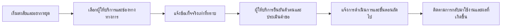

# C+A หลังตรวจบริการเดิม: มีจังหวะช่วย แต่ยังไม่มีเหตุผลซื้อที่พิสูจน์แล้ว

**ผลต่อเนื่อง 26 ก.ย. 2569:** [โจทย์เดิมพันจากคำบอกเล่าเพิ่มเติม](problem-bet.md) เลือกตรวจความไม่แน่นอนต่อผลของการขอช่วยและการทำขั้นถัดไป พร้อม [หลักฐานที่สนับสนุน/หักล้าง](exit-evidence.md) ยังไม่เปลี่ยนคำตัดสินไม่ลงทุนผลิตภัณฑ์แยก และยังไม่ยืนยันการป้องกันครั้งแรก

25 กันยายน 2569 · ข้อสรุปจากการตรวจเอกสาร 6 ผู้ให้บริการ ไม่ใช่ผลทดสอบผู้ใช้

## คำตัดสิน

**ยังไม่สร้างผลิตภัณฑ์แยกสำหรับอธิบายความเสี่ยงและบอกช่องทางขอช่วย** งานส่วนนี้ซ้ำกับบริการเดิมมากพอที่จะหักล้างคำกล่าวอ้างว่าเป็นช่องว่างใหม่ ส่วนที่ยังควรพิสูจน์คือการช่วยคนซึ่งเคยให้ผู้อื่นเข้าถึงบัญชีหรือร่วมทำรายการ แล้วเริ่มอยากหยุด ให้ส่งคำขอที่ผู้ให้บริการเข้าใจและจัดการได้ โดยไม่ต้องรู้ก่อนว่าบัญชีถูกใช้ไปแล้วหรือยัง

คำตัดสินนี้ลดระดับความพร้อมลงทุนของ C+A แต่ไม่ใช่หลักฐานว่าไม่มีใครต้องการความช่วยเหลือ เราแยก **ความสำคัญของปัญหา** ออกจาก **เหตุผลที่องค์กรจะซื้อซอฟต์แวร์ของทีม**

## สิ่งที่ตรวจพบเพิ่มจากรอบ A/B/C

1. **การช่วยหลังเปิดเผยข้อมูลมีอยู่แล้วอย่างชัดเจน** SCB มีคำแนะนำเมื่อเผลอให้ข้อมูลและช่องทางสงสัยบัญชีถูกยึด ส่วน Shopee มีคำแนะนำตรงถึงกรณีส่งบัญชี/ข้อมูลให้บุคคลน่าสงสัย จึงไม่ควรเสนอว่าเราจะสร้างจุดเริ่มขอช่วยเป็นรายแรก [SCB](https://www.scb.co.th/th/personal-banking/scb-cybersecurity), [Shopee](https://help.shopee.co.th/portal/4/article/80378) (EH01, EH08)
2. **การขอระงับโดยเจ้าของมีช่องทางใน e-Money** TrueMoney ระบุการขอระงับการใช้เงินในวอลเล็ท และ LINE Pay มีคำแนะนำระงับฉุกเฉินจากอุปกรณ์หายหรือสาเหตุอื่น เอกสารเหล่านี้ไม่ได้ยืนยันว่าทุกกรณีที่เคยยินยอมให้ใช้บัญชีจะได้รับการจัดการแบบเดียวกัน [TrueMoney ข้อ 14.4](https://www.truemoney.com/terms-conditions/), [LINE Pay หัวข้อระงับบริการ](https://help2.line.me/linepay_th/ios?country=TH&lang=th) (EH05, EH11)
3. **ไม่ควรออกแบบให้ทุกเรื่องเป็นการร้องเรียนเต็มรูปแบบ** กรุงไทยแยกเวลางานร้องเรียนจากช่องทางเร่งด่วน ส่วนเอกสารร้องเรียน TrueMoney มีข้อมูล/หลักฐานและขั้นติดตามของตน ต้องไม่ยกเงื่อนไขร้องเรียนทั้งหมดไปขวางการแจ้งเหตุความปลอดภัย [กรุงไทย](https://complaint.krungthai.com/complaint/Customer/Default.aspx), [TrueMoney ร้องเรียน](https://www.truemoney.com/complaint/) (EH03, EH06)
4. **พบวิธีติดต่อ ไม่เท่ากับพิสูจน์ว่าผู้ใช้เข้าถึงสำเร็จ** เอกสาร Shopee กล่าวถึงการช่วยผู้เข้าใช้งานไม่ได้ แต่หน้าติดต่อที่ตามลิงก์ไปเน้นแชตในแอป การตรวจนี้ยังไม่ได้ลองสถานะออกจากระบบ จึงเป็นคำถามให้ทดสอบ ไม่ใช่ข้อสรุปว่าช่องทางใช้ไม่ได้ (EH09–EH10)

รายละเอียดที่ตรวจได้และไม่ได้ของแต่ละรายอยู่ใน [provider-paths.md](provider-paths.md) ไม่จัดอันดับธนาคารจากความยาวของหน้าเว็บหรือจำนวนคำตอบที่ค้นเจอ

## ปัญหาที่แคบลงและหักล้างได้

**กลุ่ม:** เจ้าของบัญชีที่เริ่มสงสัยหลังเคยอนุญาตให้ใช้/ให้ข้อมูล/ช่วยทำรายการ และต้องการหยุด ไม่รวมผู้ที่ยังตั้งใจร่วมมือเป็นกลุ่มเป้าหมายหลัก

**จังหวะ:** ต้องการขอจัดการความปลอดภัยขณะยังไม่ทราบธุรกรรมทั้งหมด อาจยังเข้าแอปได้หรือไม่ได้ และอาจมีเงินที่จำเป็นต่อชีวิตอยู่ในบัญชี

**สมมติฐานปัญหา:** การเล่าเรื่องไม่ตรงหมวดบริการ ความไม่แน่ใจว่าติดต่อได้หรือไม่ และการส่งต่อระหว่างฝ่าย อาจทำให้คำขอไปไม่ถึงผู้ที่ดำเนินการได้ ขณะนี้ **ยังไม่มีข้อมูลไทยยืนยันความถี่ เวลาที่เสีย หรือสาเหตุหลักดังกล่าว** คำบอกเล่าเดิมและสถานการณ์ C07/A07 ใช้ตั้งคำถาม ไม่ใช้เป็นหลักฐานวัดขนาดปัญหา

**งานที่เสนอให้ทดสอบ:** ช่วยแยกสิ่งที่รู้/ไม่รู้ ขอบเขตที่เคยให้เข้าถึง และสิ่งที่ต้องการให้ผู้ให้บริการตรวจ จากนั้นส่งผู้ใช้เข้าช่องทางเดิมได้ทันที หากมีพันธมิตรจึงตรวจต่อว่ารับคำขอแล้ว ทำอะไรแล้ว และต้องทำอะไรต่อ

แผนภาพเป็นโครงงานสำหรับการทดสอบ ไม่ใช่กระบวนการที่ทั้งหกรายรับรอง ทีมช่วยออกแบบ B–C ได้เอง แต่ D–F ต้องอาศัยผู้ให้บริการ ข้อจำกัดนี้ทำให้การเชื่อมระบบและความร่วมมือสำคัญกว่าการมีแชตบอต

## จุดที่เกือบถูกมองข้าม

| ประเด็น | ผลต่อการออกแบบ/การวัด | สถานะหลักฐาน |
|---|---|---|
| เจ้าของยังมีมือถือ แต่ทำตามคำสั่งคนอื่น | อย่าใช้เพียงคำถามว่าโทรศัพท์หายหรือไม่; ต้องอธิบายสิ่งที่เคยอนุญาต | กลไกจากฐานเดิมและ C03; ความถี่ไทยยังไม่ทราบ |
| ขอช่วยก่อนรู้ธุรกรรมทั้งหมด | ช่องข้อมูลควรยอมรับว่าไม่ทราบ ไม่บังคับยอด/จำนวนคดีที่ผู้ใช้ตอบไม่ได้ | ข้อเสนอออกแบบจากข้อจำกัดข้อมูล ไม่ใช่ข้อกำหนดธนาคาร |
| คำว่าระงับมีหลายความหมาย | แยกหยุดบริการที่เจ้าของร้องขอ การจำกัดจากความเสี่ยง และการอายัดตามอำนาจ; ไม่สัญญาว่ายกเลิกได้เหมือนกัน | เอกสาร EH05/EH06/EH11 ครอบคลุมคนละงาน ไม่พิสูจน์ผลทางกฎหมาย |
| มีการรับเรื่องแล้ว แต่ยังไม่ยืนยันจัดการการเข้าถึง | บันทึกผลสองระดับ ไม่แสดงว่าปลอดภัยเพียงเพราะได้เลขอ้างอิง | หลักการวัด ไม่ใช่ข้อค้นพบว่าผู้ให้บริการทำไม่สำเร็จ |
| เงินยังจำเป็นต่อชีวิตประจำวัน | ให้ถามขอบเขตการจำกัดและทางกลับมาใช้ ไม่สร้างปุ่มหยุดทุกอย่างโดยอัตโนมัติ | ภาระที่ต้องวัด ยังไม่มีอัตราความเสียหายจากรอบนี้ |
| การติดต่อเพิ่มอีกชั้นอาจช้าลง | ช่องทางทางการต้องเข้าถึงได้ก่อนกรอกข้อมูล; ทดสอบว่าการเตรียมเรื่องเพิ่มประโยชน์เกินภาระหรือไม่ | เงื่อนไขหักล้างผลิตภัณฑ์ |

เราไม่วินิจฉัยความผิด ไม่รับรองผลคดี ไม่ถือว่าผู้ขอช่วยเป็นม้า และไม่แนะนำให้ลบบัญชีหรือโอนเงินออกเป็นวิธีแก้โดยอัตโนมัติ

## ผลต่อการเลือกธุรกิจและตลาด

| ทางเลือก | คำตัดสินจากหลักฐานปัจจุบัน | เหตุผล |
|---|---|---|
| C+A แบบเว็บ/แชตให้ความรู้และรวมช่องทาง | **ไม่ลงทุนสร้างเป็นธุรกิจแยกตอนนี้** | คู่เทียบทำงานหลักแล้ว; ไม่มีสิทธิข้อมูล ผลที่เหนือกว่า หรือผู้ซื้อยืนยัน |
| C+A เป็นส่วนเสริมในบริการของธนาคาร/e-Money | **ศึกษาต่อแบบมีเงื่อนไข** | มีผู้ดำเนินการปลายทางอยู่แล้ว แต่ต้องพบงานส่งต่อที่ติดจริงและเจ้าของงบก่อน |
| A สำหรับงานหลังจำกัดบัญชี | เก็บเป็นทางสำรอง | ทดสอบลดงานเอกสารได้ แต่ไม่ตอบเป้าป้องกันครั้งแรกโดยตรง และ ROI เดิมยังไม่ผ่าน |
| B สำหรับแพลตฟอร์มหางาน | คงสถานะรอช่องว่างเฉพาะองค์กร | รอบก่อนพบระบบรายงานใกล้เคียงอยู่แล้ว รอบนี้ไม่ได้เพิ่มหลักฐานให้ B |

ผู้ใช้งานสมมติของส่วนเสริม C+A คือเจ้าของบัญชีและเจ้าหน้าที่รับเรื่อง ผู้ถือปัญหาที่ต้องยืนยันคือ Fraud Operations/Customer Operations ผู้ร่วมอนุมัติอาจเป็น Digital Product, Compliance และฝ่ายความปลอดภัย ส่วนผู้ถือเงินงบประมาณยังไม่ทราบ **รายชื่อฝ่ายเหล่านี้เป็นสมมติฐาน ไม่ใช่ลูกค้าที่ตอบรับ**

รายได้ที่สมเหตุผลจะต้องผูกกับซอฟต์แวร์ซึ่งองค์กรใช้ซ้ำและปริมาณงานที่ลดได้ ไม่ใช่ค่ารับทำเรื่องรายบุคคล ไม่เสนอส่วนแบ่งเงินที่ปลดได้ และไม่ยกค่าธรรมเนียมเดิมของ A มาเป็นราคา C+A โดยอัตโนมัติ

ส่วนที่อาจใช้ซ้ำ: ชุดข้อมูลส่งต่อ โครงคำขอ การแยกสถานะ และการวัดผล ส่วนที่เพิ่มต้นทุน: กติกาเฉพาะผู้ให้บริการ การเชื่อมระบบและทบทวนเนื้อหา หากต้องมีคนของทีมโทรประสานทุกเคส งานนี้จะกลายเป็นบริการใช้แรงงานและไม่ผ่านเงื่อนไขธุรกิจเดิม

**ไม่เพิ่ม TAM/SAM/SOM:** ไม่มีหลักฐานว่าการเพิ่มจังหวะนี้ทำให้มีผู้ซื้อหรือราคาใหม่ ไม่รวม TAM ของ A กับ C และไม่ใช้ผู้ใช้บัญชีทั้งหมดเป็นตลาดซื้อซอฟต์แวร์ งาน SG/MY ในรายงานเดิมยังเป็นบริบทการขยาย ไม่ใช่ยอดขายที่เข้าถึงแล้ว

## การตัดสินใจก่อนใช้เงินสร้าง MVP

เดินต่อเฉพาะเมื่อมีหลักฐานทั้งสามชั้น ไม่ใช้คะแนนรวมกลบข้อที่ไม่ผ่าน:

1. **ผู้ใช้:** พบอุปสรรคในการเริ่มคำขอในจังหวะนี้จริง และชุดเตรียมเรื่องช่วยกว่าวิธีเดิมที่ปรับดีแล้ว โดยไม่ทำให้ติดต่อช้าหรือกลัวเกินเหตุ
2. **ผู้ดำเนินการ:** มีฝ่ายรับเรื่องซึ่งยืนยันงานที่ทำต่อได้ ระบุข้อมูลจำเป็นและข้อจำกัด และให้วิธีตรวจผลตามสิทธิที่ตกลงกัน
3. **ผู้ซื้อ:** มีเจ้าของงบ เหตุผลซื้อ และปริมาณงานที่ทำให้ประโยชน์ที่วัดได้รองรับต้นทุนรวม ไม่ใช่เพียงคำชมแนวคิด

หากไม่มีพันธมิตร ทีมทำได้เพียงทดสอบความเข้าใจ/การเตรียมเรื่อง ไม่สามารถพิสูจน์การถอนการเข้าถึงหรือการลดบัญชีม้าเกิดใหม่ ชุดดำเนินการถัดไปที่เป็นรูปธรรมอยู่ใน [validation-kit.md](validation-kit.md) รอบนี้ยังไม่ติดต่อหรือทดลองกับบุคคลใด
