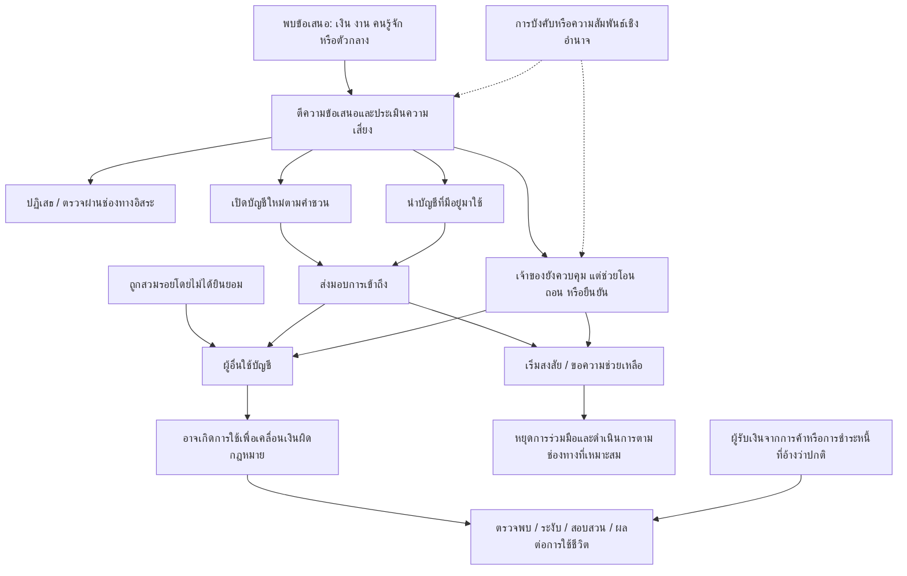

# ลดการเข้าสู่วงจรบัญชีม้า โดยรักษาการเข้าถึงบริการของคนสุจริต

รายงานค้นคว้าจากเอกสาร • 25 กันยายน 2569 (2026-09-25, Asia/Bangkok)

[ทะเบียนหลักฐาน](evidence-register.md) • [ทะเบียนกรณี](case-register.md) • [วิธีค้นและข้อจำกัด](methods-and-search-log.md) • [ตรวจข้อกล่าวอ้างเดิม](claim-audit.md)

## 1. ข้อค้นพบที่ใช้ตัดสินใจได้

**ยังไม่มีหลักฐานพอให้สรุปว่า “เปิดบัญชีง่าย” เป็นสาเหตุหลักของการเข้าสู่วงจรบัญชีม้าในไทย หรือว่าการเพิ่มขั้นตอนเปิดบัญชีจะลดปัญหาได้คุ้มกับภาระผู้สุจริต** ข้อมูลที่มีรองรับให้แยกโจทย์ตามการตัดสินใจและการควบคุมบัญชี มากกว่าจัดทุกคนเป็นผู้เปิดใหม่แล้วขายบัญชี

จากโพสต์เดิม 50 หน่วยและกรณีสาธารณะเพิ่ม 4 หน่วย พบทั้งข้อเสนอเปิดใหม่ การเสนอบัญชีที่มีอยู่ การจ้างเจ้าของโอนหรือถอนเงิน การอ้างถูกเพื่อนหลอก และการรับเงินที่ผู้โพสต์อ้างว่ามาจากธุรกรรมปกติแล้วถูกกระทบ แต่ไม่ทราบอัตราของแต่ละเส้นทางในประชากร และไม่ยืนยันว่าประกาศใดซื้อขายสำเร็จ [M05](case-register.md#M05), [M16](case-register.md#M16), [M15](case-register.md#M15), [H12](case-register.md#H12), [H10](case-register.md#H10)

ข้อสรุปเพื่อเดินต่อมีสามข้อ:

1. **ช่วงถูกชวนและกำลังตีความข้อเสนอ** มีเหตุผลพอให้ทดสอบว่าคนแยก “งาน/ความช่วยเหลือปกติ” ออกจาก “ให้ผู้อื่นใช้บัญชีหรือให้เราทำแทน” ได้หรือไม่ ความรู้คำว่าบัญชีม้าไม่เท่ากับการจำแนกสถานการณ์ได้ หลักฐานไทยยังจำกัด และผู้ร่วมมือเพื่อเงินทั้งที่รู้ความเสี่ยงอาจไม่ตอบสนองต่อการให้ข้อมูล [S09](evidence-register.md#S09), [S14](evidence-register.md#S14), [M12](case-register.md#M12)
2. **ช่วงเริ่มสงสัยหลังยินยอมหรือส่งมอบบางอย่างแล้ว** มีเหตุผลพอให้ทดสอบการหาทางช่วยเหลือที่เข้าใจง่ายและน่าเชื่อถือ หลายโพสต์สับสนเรื่องสถานะ คดี และหน่วยงาน แต่โพสต์ส่วนมากอยู่หลังเกิดเรื่อง จึงยังไม่พิสูจน์ว่าความติดขัดแบบเดียวกันเกิดก่อนใช้บัญชีผิดครั้งแรก [H05](case-register.md#H05), [H07](case-register.md#H07), [H19](case-register.md#H19)
3. **มาตรการรัฐและผู้ให้บริการมีทั้งป้องกัน ตรวจจับ ระงับ และเยียวยาแล้ว** โอกาสใหม่ต้องพิสูจน์ส่วนเพิ่มจากประสบการณ์ปัจจุบัน ไม่อ้างว่าทุกหน่วยงานทำเฉพาะตามเงินหลังเสียหาย [S01–S06](evidence-register.md#S01)

คัด **สองโจทย์สำหรับทดลองขั้นต่อไป** ในหัวข้อ 7 ยังไม่เลือกผลิตภัณฑ์ ไม่สร้างระบบ ไม่ทำการทดลอง และไม่อ้างว่าลดจำนวนบัญชีม้าได้แล้ว

## 2. สิ่งที่ข้อมูลชุดนี้บอกได้และบอกไม่ได้

| ฐานข้อมูล | สิ่งที่ตรวจ | ใช้ตอบอะไร | ใช้ตอบไม่ได้ |
|---|---|---|---|
| ตลาดบัญชี M01–M30 | เนื้อหาและคอมเมนต์ในไฟล์ที่ผู้ใช้ให้ ครบ 30 โพสต์ | ภาษาข้อเสนอ เงื่อนไขที่กล่าวอ้าง การต่อรอง รูปแบบงาน | การจ่ายจริง ความผิด เจตนา จำนวนคนไม่ซ้ำ ความชุก |
| กลุ่มขอช่วย H01–H20 | ครบ 20 โพสต์ แยกเรื่องผู้โพสต์จากผู้ตอบ | ความสับสนและผลกระทบที่เล่า การหาคนช่วย | ข้อเท็จจริงคดี คุณภาพผู้รับช่วย ระยะเวลาดำเนินการจริง |
| P01–P04 | ข่าวการปฏิเสธ ข่าวแรงกดดัน ข่าวเจ้าของร่วมทำ และคำพิพากษาบริบท | ท้าทายสมมติฐานและเพิ่มเส้นทางที่ข้อมูลเดิมขาด | สัดส่วนประเทศหรือข้อยุติของกรณี Facebook |
| S01–S31 | กฎหมาย มาตรการ เอกสารผู้ให้บริการ งานวิจัย ข่าว และแหล่งที่อ่านได้บางส่วน | สถานะนโยบาย กลไกที่เป็นไปได้ ข้อจำกัดวิธีศึกษา | ผลเชิงเหตุเป็นผลที่แหล่งไม่ได้วัด |

วันที่เก็บโพสต์คือ 19 ก.ย. 2569 ไม่ใช่วันเกิดเหตุของทุกกรณี ตัวอย่าง H02 กล่าวถึงเหตุ 31 ต.ค. 2568; ข่าว P02 อ้างเหตุช่วงโควิด แม้เผยแพร่ปี 2568 จึงใช้เป็นบริบทเท่านั้น จำนวน 50 โพสต์ไม่เท่ากับ 50 คนหรือ 50 บัญชีม้า ในทะเบียนคัด 40 โพสต์เป็นเนื้อหาหลัก 8 เป็นบริบท และ 2 ไม่ใช้สรุปกลไก การคัดนี้เป็นการจัดเอกสาร ไม่ใช่ผลสำรวจประชากร

**ประเภทบริการต้องแก้ก่อนตั้งสมมติฐาน:** MAKE เป็นเงินฝาก K-eSavings ของกสิกรไทย; Kept เป็นบริการเงินฝากของกรุงศรี; บัญชีเงินฝากที่เข้าถึงผ่าน LINE BK ต้องแยกจากผลิตภัณฑ์อื่นในบริการเดียวกัน ทั้งหมดไม่ควรถูกเรียกรวมว่า Virtual Bank เพราะใช้งานผ่านแอป ส่วน e-Money เป็นเงินอิเล็กทรอนิกส์ภายใต้ผู้ให้บริการและเกณฑ์ที่เกี่ยวข้อง ไม่ใช่เงินฝากทุกกรณี [S22](evidence-register.md#S22), [S23](evidence-register.md#S23), [S24](evidence-register.md#S24), [S05](evidence-register.md#S05)

Virtual Bank เป็นธนาคารพาณิชย์ไร้สาขาตามกรอบเฉพาะ ไม่ใช่คำแทนการเปิดบัญชีออนไลน์ รายงานนี้ไม่ได้ยืนยันสถานะเปิดบริการจริงของแต่ละผู้ได้รับอนุญาต ณ วันที่ค้น และไม่ใช้กำหนดเปิดใน FAQ เป็นหลักฐานว่าเปิดแล้ว ชื่อ “คลิก/CLIX” และคำว่า wallet ในโพสต์ระบุผู้ให้บริการไม่พอ จึงคงเป็น “ไม่ทราบ” [S25](evidence-register.md#S25), [M03](case-register.md#M03), [M17](case-register.md#M17)

## 3. เส้นทางและกลไกที่ควรแยก

แผนภาพนี้เป็น **การสังเคราะห์เส้นทางที่พบหรือเป็นสมมติฐานให้ตรวจ** ลูกศรไม่ได้หมายถึงความสัมพันธ์เชิงเหตุผลที่พิสูจน์แล้ว ไม่มีความน่าจะเป็นกำกับ

ข้อเสนอเปิดใหม่ปรากฏใน M05; บัญชีที่มีอยู่และงานโอนปรากฏใน M16; เจ้าของร่วมทำปรากฏใน M15 และข่าว P03; เส้นทางขอช่วยผ่านคนรู้จักมี H12; การปฏิเสธมี P01; การรับเงินธุรกรรมปกติที่ถูกกระทบเป็นคำบอกเล่า H10 ไม่ใช่ข้อยุติความสุจริต ส่วนการสวมรอยอยู่ในขอบเขตมาตรการ S02 แต่ข้อมูลกรณีชุดนี้ไม่พออธิบายเส้นทางนั้นโดยละเอียด

การใช้บัญชีผิดครั้งแรกอาจเกิดก่อนเจ้าของรู้ตัว การระงับอาจมาทีหลังนาน และการอายัดไม่ใช่คำพิพากษา ดังนั้นต้องบันทึกเวลาอย่างน้อยแยกเป็น ถูกชวน–เปิด–ยินยอม/ให้เข้าถึง–เริ่มใช้ผิด–ตรวจพบ–ระงับ ไม่ใช้ช่วงเปิดถึงระงับแทนทุกช่วง

| ชั้นของคำอธิบาย | สมมติฐานที่มีเหตุผลให้ตรวจ | หลักฐานและข้อจำกัด |
|---|---|---|
| เหตุให้ตัดสินใจเข้าร่วม | ต้องการเงินเร็ว เชื่อว่าเป็นงานหรือการช่วยคนที่ไว้ใจ ประเมินผลเสียต่ำ หรือมีแรงกดดัน | M04/M05, H12, P02; ไม่ใช่สาเหตุจำเป็นหรือเพียงพอ มี P01 ปฏิเสธ |
| ปัจจัยเอื้อให้ทำได้ | เข้าถึงข้อเสนอ ตัวกลาง บัญชีที่เปิดหรือมีอยู่ การส่งมอบสิทธิ หรือเจ้าของร่วมยืนยัน | M07/M15/M16; ไม่มีหลักฐานสัดส่วนแต่ละรูปแบบ |
| เหตุที่ทำต่อ/ออกยาก | ไม่แน่ใจว่าสิ่งที่ทำเสี่ยงเพียงใด ไม่ไว้ใจคู่ค้า/ช่องทางช่วย กลัวผลตามมา หรือพึ่งรายได้ | M09/M12, H05/H07 และ S13; ช่วงก่อนใช้ผิดครั้งแรกในไทยยังไม่ยืนยัน |
| ผลตามมา | บัญชีใช้งานไม่ได้ ค่าเดินทาง/ดำเนินเรื่อง งานและเงินยังชีพได้รับผลกระทบ | H03/H11/H16 และ S06; ผลกระทบไม่พิสูจน์เหตุเข้าสู่วงจร |

**ยังเรียกข้อใดข้อหนึ่งว่า root cause ของทั้งประเทศไม่ได้** คำอธิบายที่เหมาะสมกว่าในรอบนี้คือชุดกลไกหลายแบบ ซึ่งต้องเลือกกลุ่มเป้าหมายและจังหวะก่อนทดสอบว่าการเปลี่ยนกลไกนั้นเปลี่ยนพฤติกรรมจริงหรือไม่

## 4. ผลทดสอบสมมติฐานทั้งหก

คำว่า “จำกัด” หมายถึงเอกสารรองรับการตั้งคำถาม แต่ยังไม่พออนุมานผลเชิงเหตุผลหรือขนาดผล

| สมมติฐาน | หลักฐานสนับสนุน | ข้อหักล้าง/ข้อจำกัดที่ค้นพบ | ข้อสรุปและสิ่งที่ยังขาด |
|---|---|---|---|
| H1 เปิดง่ายเพิ่มการเข้าสู่วงจร | M05 มีข้อเสนอเปิดใหม่; M17 อ้างแอปที่ยืนยันแล้ว | M16 ใช้บัญชีเดิม; S15 พบการปิดบัญชีต้องสงสัยทั้งบัญชีใหม่และเก่า; ไม่มีตัวหารจำนวนบัญชีทั้งหมด | ยังไม่ยืนยันสาเหตุ ต้องมีช่วงถูกชวน/เปิด/เริ่มใช้ผิด และอัตราตามรุ่นบัญชี รวมปัจจัยจำนวนลูกค้าและความเข้มตรวจจับ |
| H2 แรงจูงใจเงิน | M04 อ้างหนี้ M05 ต้องการเงิน; P02 กล่าวถึงความขัดสน | P01 มีคำบอกเล่าปฏิเสธแม้เปราะบาง; หลายโฆษณาไม่บอกฐานะ; ค่าตอบแทนเสนอไม่ใช่ที่ได้รับ | รองรับบางกรณีอย่างจำกัด ไม่ใช้ฐานะ/หนี้เป็นตัวตัดสินความเสี่ยง ขาดกลุ่มผู้ถูกชวนที่ยอมเทียบกับปฏิเสธ |
| H3 ไม่เข้าใจ/ประเมินเสี่ยงต่ำ | H12/H14 อ้างถูกหลอก; S09 เสนอประเด็นความรู้; S14 แสดงข้อจำกัดการจำแนกสถานการณ์ | M12 กังวลเรื่องจ่ายจริง แต่อ่านระดับความรู้กฎหมายไม่ได้; คำตอบว่าจะไม่ทำไม่เท่ากับทำจริง | ควรทดสอบการรู้จำพฤติกรรมเฉพาะ อย่าถือว่าทุกคนขาดความรู้; ยังไม่มีผลทดลองลดม้าใหม่ในไทยที่พบในการค้นนี้ |
| H4 ความไว้ใจ/แรงกดดัน | H12 กล่าวถึงเพื่อน; M07 นายหน้า; P02 อำนาจที่ไม่เท่ากัน; S13 ความสัมพันธ์ | M04/M16 แสดงการเสนอตนเอง แต่ไม่ทราบแรงกดดันเบื้องหลัง; รีวิวใน H09 อาจเป็นโฆษณา | แยกถูกหลอก ถูกบังคับ และร่วมมือเพื่อเงิน; ความไว้ใจเป็นกลไกที่เป็นไปได้ ไม่ทราบความชุก |
| H5 ปัญหาอยู่ที่การควบคุมบัญชี | M15 ขอให้เจ้าของมาด้วย; P03 รายงานช่วยยืนยันใบหน้า | การยืนยันตัวตนยังมีหน้าที่ป้องกันสวมรอย S02; H10 ไม่มีการส่งมอบตามเรื่องที่เล่า | ยืนยันตัวตนตอบว่าใครทำ ไม่ได้ตอบเพียงลำพังว่าทำเพื่อใคร/เข้าใจอะไร; ไม่สรุปว่า KYC ใช้ไม่ได้ |
| H6 ถอนตัวลำบาก/กลับมาทำซ้ำ | H05/H07/H19 สับสนการช่วย; M09 อ้างไม่ได้ค่าจ้างแล้วยังถูกขอเพิ่ม; S13 กล่าวถึงอุปสรรคขอช่วย | S01/S29 มีคำแนะนำและช่องทางอยู่แล้ว; โพสต์ไทยส่วนมากเกิดหลังถูกกระทบ; ไม่พบการติดตามรายเดิม | รองรับปัญหาหาทางช่วยหลังเกิดเรื่อง แต่ช่วงก่อนใช้ผิดและอัตราทำซ้ำยังไม่ทราบ ต้องแยกการป้องกันครั้งแรกจากลดความเสียหายต่อเนื่อง |

ฐานวิจัยไทยที่พบใน S09 เป็นบทคัดย่อวิทยานิพนธ์ปี 2567 สัมภาษณ์ผู้เชี่ยวชาญ 15 คนจากสี่กลุ่ม ไม่ใช่การเก็บประสบการณ์ตรงจากผู้เปิดบัญชีม้าตามตัวอย่างที่ระบุ จึงใช้ประกอบสมมติฐาน ไม่ใช้พิสูจน์ว่าคำเตือนเปลี่ยนการตัดสินใจ หรือว่าครอบครัว/ความรู้เป็นเหตุของทุกกรณี ยังไม่ได้อ่านวิธีวิเคราะห์ฉบับเต็ม [S09](evidence-register.md#S09)

งานไทยอีกชิ้นที่พบช่วงตรวจหลักฐานหักล้างเป็นกรณีศึกษาสาขาธนาคารในอุดรธานี ระบุการเก็บข้อมูลสี่กลุ่มรวม 26 คน และรายงานว่าผู้มาติดต่อบางส่วนมีความรู้กฎหมายอยู่แล้ว แต่ไม่ได้ให้ความสำคัญกับความเสี่ยงมากนัก จึงช่วยจำกัดสมมติฐานว่าให้ความรู้เพียงอย่างเดียวจะเพียงพอ อย่างไรก็ตาม เป็นการรับรู้/คำบอกเล่าในพื้นที่เดียว วิธีบางส่วนเขียนเป็นแผน และตารางกลุ่มผู้เคยรับจ้างมีผู้กล่าวถึงญาติหรือยังไม่เปิดบัญชีด้วย จึงไม่รับการจัดประเภทนั้นเป็นข้อยุติ ไม่ใช้พิสูจน์ผลของการเพิ่มโทษหรืออัตราความรู้ในไทย [S31](evidence-register.md#S31)

## 5. มาตรการที่มีอยู่และขอบเขตช่องว่าง

สถานะต่อไปนี้แยก **เอกสารมีผล/ประกาศดำเนินงาน** ออกจาก **ผลประเมิน** ไม่ได้ตรวจการปฏิบัติตามจริงของธนาคารทุกราย

| มาตรการและสถานะ ณ วันที่ค้น | ช่วง/กลุ่ม | ผู้ทำและข้อมูลที่ต้องใช้ | ผลต่อผู้สุจริต/การทบทวน | สิ่งที่หลักฐานยังไม่ตอบ |
|---|---|---|---|---|
| KYC ตรวจข้อเท็จจริง ป้องกันสวมรอย ตาม ธปท. 19/2568; มีผล 8 ส.ค. 2568 [S02–S03](evidence-register.md#S02) | เปิด/ใช้บริการ | ธนาคาร; ตัวตน อุปกรณ์และข้อมูลตรวจสอบ | ยืนยันเพิ่มอาจเสียเวลา; ต้องดูทางเลือก/กระบวนการของแต่ละราย | ผลต่อการที่เจ้าของจริงร่วมทำ และภาระจริง |
| ผูกบัญชีผู้ใช้งาน Mobile Banking กับอุปกรณ์ ตาม S02 | การเข้าถึงบัญชี | ธนาคาร; การลงทะเบียน/อุปกรณ์ | เปลี่ยนเครื่องอาจต้องยืนยันใหม่ | ไม่ใช่หนึ่งบัญชีเงินฝากต่อเครื่อง; ไม่พิสูจน์ว่าป้องกันเจ้าของทำแทนได้ |
| ตรวจบุคคลเสี่ยง/แลกเปลี่ยน CFR; ธปท. อธิบายใช้ข้ามธนาคารตั้งแต่ 1 ส.ค. 2567 [S01](evidence-register.md#S01) | เปิดใหม่/ใช้ซ้ำ/บัญชีเชื่อมโยง | ธนาคารและโครงสร้างข้อมูลร่วม; flags/ข้อมูลเหตุ | อาจกระทบหลายบริการ ต้องมีพิสูจน์ข้อเท็จจริง | false positive rate, coverage และเวลาแก้ข้อมูล; ไม่ทราบ API ที่ทีมใช้ได้ |
| วงเงินตามพฤติกรรมและการแจ้งเงินออก; มาตรการประกาศใช้งาน [S03](evidence-register.md#S03) | ผู้ใช้งาน/ธุรกรรม | ธนาคาร; ประวัติการใช้/ข้อมูลลูกค้า | ความต้องการใช้จริงอาจเกินวงเงิน; ต้องตรวจการขอปรับของแต่ละราย | ผลเชิงเหตุผลต่อม้าใหม่และการย้ายบัญชี |
| วงเงินเริ่มต้นเยาวชน; ประกาศ 31 ก.ค. 2569 ทยอยให้แล้วเสร็จ ก.ย. สำหรับธนาคาร และ ต.ค. สำหรับ e-Money [S04](evidence-register.md#S04) | กลุ่มเยาวชน ไม่ใช่ผู้เปิดใหม่ทุกคน | ธนาคาร/e-Money; อายุ/การใช้งาน | ประกาศให้แจ้งล่วงหน้าและมีช่องทางขอเพิ่ม | ณ 25 ก.ย. ยังไม่พ้นกำหนดทั้งหมด ไม่อ้างผลสำเร็จ; ไม่ใส่วงเงินที่อยู่ในภาพซึ่งไม่ได้ตรวจ |
| มาตรฐานธุรกิจชำระเงิน ธปท. 58/2568 มีผล 23 ธ.ค. 2568 [S05](evidence-register.md#S05) | ตามขอบเขตผู้ประกอบธุรกิจชำระเงิน | ผู้ให้บริการที่เข้าเกณฑ์; ตัวตน/การใช้/ความเสี่ยง | ต้องดูข้อกำหนดและกระบวนการของบริการนั้น | ห้ามนำข้อกำหนดธนาคารทุกข้อมาใช้กับทุก wallet โดยอัตโนมัติ |
| ตรวจธุรกรรมและจำกัดความเสียหาย/ระงับ [S02](evidence-register.md#S02), [S08](evidence-register.md#S08) | เริ่มใช้เงิน/ตรวจพบ | ผู้ให้บริการและหน่วยงาน; ธุรกรรม/แจ้งเหตุ | ผู้รับเงินสุจริตอาจได้รับผล; ต้องจำแนกเหตุ/ฐานอำนาจ | ไม่มีข้อมูลภายในให้ประเมินความแม่นยำหรือจุดตัดของโมเดล |
| พิสูจน์ข้อเท็จจริง ปลดระงับ และบัญชีเพื่อยังชีพ [S01](evidence-register.md#S01), [S06](evidence-register.md#S06) | ผู้ได้รับผลกระทบ | ธนาคาร/หน่วยงานที่เกี่ยว; หลักฐานและรอบข้อมูล | มีมาตรการบรรเทาแล้ว แต่สิทธิและขั้นตอนขึ้นกับเหตุ | ช่วง 4 ชม.–1 วันที่ประกาศไม่ใช่เวลาจริงทุกคดี; ระงับธุรกรรมต่างจากอายัด |
| คำเตือนงานหลอก/คำแนะนำหลังถูกหลอก [S07](evidence-register.md#S07), [S29](evidence-register.md#S29) | ก่อนยินยอมและหลังสงสัย | หน่วยงาน/ธนาคาร; ไม่จำเป็นต้องใช้ข้อมูลธุรกรรมเพื่อให้ความรู้ | การอธิบายกว้างเกินไปอาจทำให้กลัวงานปกติ | การเข้าถึง ณ จังหวะตัดสินใจ ความเข้าใจ และผลต่อพฤติกรรมยังไม่ยืนยัน |
| จัดการการโฆษณาหาบัญชี/ความรับผิดผู้เกี่ยวข้อง [S26–S27](evidence-register.md#S26) | ต้นทางจัดหา/ผู้ให้บริการ | หน่วยงาน/แพลตฟอร์มตามหน้าที่; เนื้อหาและพยาน | ต้องไม่ตีความงาน/การใช้บัญชีปกติผิดและมีทบทวน | พบกรอบกฎหมาย แต่ไม่พบผลประเมินไทยที่แยกการลดรับสมัครสำเร็จจากยอดลบโพสต์ในการค้นครั้งนี้ |

มาตรา 9 ของกฎหมายปี 2566 มีองค์ประกอบเกี่ยวกับการรู้หรือควรรู้และวัตถุประสงค์ ไม่ใช่เพียงมีเงินบุคคลที่สามผ่านบัญชีแล้วผิดทุกกรณี กฎหมายปี 2568 แก้กรอบหน้าที่/ความรับผิดเพิ่มเติม จึงไม่ใช้ข้อความจากบทความกฎหมายเก่าว่า “ไม่มีความผิดเฉพาะ” เป็นสถานะปัจจุบัน การติดต่อขอช่วยไม่ได้รับรองว่าจะไม่มีความรับผิด และคำแนะนำไกล่เกลี่ยใน Facebook ไม่ใช่ผลกฎหมายทั่วไป [S26](evidence-register.md#S26), [S27](evidence-register.md#S27), [S28](evidence-register.md#S28)

**ช่องว่างที่น่าตรวจคือคุณภาพการตัดสินใจและการเข้าสู่ช่องทางช่วยที่มีอยู่** ยังไม่ใช่ข้อยืนยันว่าต้องสร้างช่องทางใหม่ นอกจากนี้ ข้อมูล public API ของ NITMX ที่ค้นได้ไม่พอยืนยันว่ามีคำสั่งตรวจความถี่เปิดบัญชีข้ามธนาคาร หรือว่าทีมมีสิทธิใช้งานดังกล่าว [S30](evidence-register.md#S30)

## 6. ต่างประเทศ: ใช้เปรียบเทียบกลไก ไม่ถ่ายโอนผล

| ประเทศ/หลักฐาน | ระดับการดำเนินงานและวิธีวัด | กลไก/ข้อมูล/ผู้เข้าถึง | สิ่งนำมาคิดกับไทย และข้อจำกัด |
|---|---|---|---|
| UK: Home Office/Ipsos ประสบการณ์ตรง [S13](evidence-register.md#S13) | งานวิจัยเผยแพร่ ก.ค. 2026; สำรวจเจาะจง 208 คน สัมภาษณ์อดีตผู้เกี่ยวข้อง 9 คน และผู้เชี่ยวชาญ 11 คน | ความไว้ใจ เงิน และการขอช่วย; ผู้ให้สัมภาษณ์อดีตผู้เกี่ยวข้องทั้งหมดเป็นกลุ่มไม่รู้ตัว | รองรับคำถามเรื่องการช่วยถอนตัว แต่ไม่เป็นตัวแทนผู้ร่วมมือโดยรู้ และข้อเสนอช่องทางปลอดภัยยังไม่ใช่ intervention ที่พิสูจน์ผล |
| UK: สำรวจประชาชน [S14](evidence-register.md#S14) | ก.พ. 2024 n=2,114 และ มี.ค. 2024 n=2,233; สถานการณ์สมมติ | 97% ในแบบสำรวจแรกบอกไม่ยอมรับ; อีกแบบสำรวจมี 18% จำแนกสามสถานการณ์ผิดกฎหมายได้ครบ | ความตั้งใจตอบกับความเข้าใจต้องวัดแยก; คนละกลุ่มตัวอย่าง ห้ามตีความเป็นความสัมพันธ์รายคนหรืออัตราคนไทย |
| UK: FCA ตรวจแนวปฏิบัติ 13 บริษัท [S16](evidence-register.md#S16) และแผนรัฐ [S18](evidence-register.md#S18) | พบการดำเนินงานจริง/การประเมินรายกรณี; แผนรัฐเป็นแผน; ไม่มีการสุ่มวัดผลในแหล่งเหล่านี้ | ธนาคารใช้ข้อมูล fraud flags พร้อมเกณฑ์หลักฐาน; รัฐเชื่อมการป้องกันกับความช่วยเหลือ | การทบทวนรายบุคคลและสิทธิใช้บริการเป็นส่วนของแบบออกแบบ ไม่ควรคัดลอกเกณฑ์ NFD เป็นกฎหมายไทย |
| UK: FCA สำรวจ 35 บริษัท ช่วง 2023–2025 [S15](evidence-register.md#S15) | ข้อมูลการปิดบริการบัญชีต้องสงสัย; 47.1% ของชุดอายุบัญชีปี 2025 ถูกปิดภายในปีแรก | ข้อมูลธนาคาร/สถาบันชำระเงิน; วัดอายุถึงปิด | บัญชีเก่าก็สำคัญ; ไม่ทราบเวลาเริ่มใช้ผิด ไม่ใช่อัตราม้าใหม่ต่อบัญชีเปิดทั้งหมด และประเภทบริษัทอังกฤษไม่เท่ากับ Virtual Bank ไทย |
| SG: Financial Restrictions Framework [S19](evidence-register.md#S19), [S20](evidence-register.md#S20) | ประกาศ ก.ย. 2025 เริ่ม 1 ต.ค. 2025; รายงาน 550 money mules ถูกจำกัด ณ 9 ก.พ. 2026 | หน่วยงาน/ผู้ให้บริการจำกัดตามความเสี่ยง เน้นผู้เกี่ยวข้องและการทำซ้ำ; พิจารณาความจำเป็นและมีช่องอุทธรณ์ | มีการดำเนินจริง แต่ 550 คือกิจกรรม ไม่ใช่จำนวนป้องกันได้; ไม่บวก SIM mules เพราะอาจซ้ำ; ไม่ใช่แบบเปิดบัญชีใหม่ทุกคน |
| AU: AUSTRAC คู่มือปี 2024 หน้าอัปเดต มี.ค. 2026 [S21](evidence-register.md#S21) | คำแนะนำผู้ให้บริการ ไม่ใช่ผลทดลองลดม้าใหม่ | สัญญาณพฤติกรรมและการเงินร่วมกัน ครอบคลุมการชักชวนต่อหน้า/ออนไลน์ โดยมีกลุ่มนักศึกษาต่างชาติในขอบเขต | สอนให้ดูบริบทหลายอย่าง ไม่คัดกรองจากสัญชาติ/สถานะนักศึกษาอย่างเดียว; ทีมไม่มีข้อมูลเทียบหรือวัดประสิทธิผลตามคู่มือ |

ไม่พบผลประเมินที่มีตัวเปรียบเทียบเพียงพอให้กล่าวว่าแนวทางให้ความรู้หรือทางถอนตัวที่เสนอในรายงานนี้ลด “การใช้บัญชีเป็นม้าครั้งแรกในไทย” ได้เท่าไร ภายใต้คำค้นและแหล่งที่บันทึกไว้ การไม่พบนี้ไม่ได้แปลว่าไม่มีงานดังกล่าวทั้งหมด

## 7. คัดโอกาสแทรกแซงและทางทดลอง

ระดับเป็นดุลยพินิจเพื่อจัดลำดับการเรียนรู้ ไม่ใช่คะแนนผลสำเร็จ “สูง” ในช่องภาระ/พึ่งพา/ซ้ำ หมายถึงข้อจำกัดมาก ไม่รวมเป็นคะแนนเดียว

| ทางเลือก | หลักฐานปัญหา | เปลี่ยนพฤติกรรมได้ | เข้าถึงทันจังหวะ | ภาระผู้สุจริต | พึ่งข้อมูล/อำนาจภายนอก | ซ้ำมาตรการ/ย้ายช่องทาง | ทดสอบโดยไม่มีธุรกรรม |
|---|---|---|---|---|---|---|---|
| O1 ช่วยตีความข้อเสนอและตรวจอิสระก่อนยินยอม | กลาง: M16,H12,S09/S14; ส่วนใหญ่ยังเป็นคำบอกเล่า | กลาง: ทดสอบความเข้าใจได้ แต่ผู้ตั้งใจร่วมอาจไม่เปลี่ยน | กลาง: ช่องหางาน/ชุมชนเป็นทางที่ต้องยืนยัน | ต่ำ หากสมัครใจ ไม่ขวางการเปิดบัญชี | ต่ำในห้องทดลอง; กลางเมื่อหาช่องเข้าถึง | กลาง: มีคำเตือนแล้ว; ย้ายไปแชตส่วนตัวได้ | สูงสำหรับการจำแนก/ภาระ ไม่ใช่ผลจริง |
| O2 ช่วยหาทางออกทันทีที่เริ่มสงสัย | กลาง: H05/H07/S13; หลักฐานก่อนใช้ผิดจำกัด | กลาง: ลดความสับสนได้เป็นสมมติฐาน | กลาง: ผู้สงสัยต้องหาเจอ/ไว้ใจ | ต่ำ–กลาง: เสี่ยงทำให้กลัวผลทางคดี | ต่ำสำหรับทดสอบนำทาง; สูงสำหรับดำเนินการบัญชีจริง | กลาง: คำแนะนำเดิมมีแล้ว; ต้องพิสูจน์ส่วนเพิ่ม | สูงสำหรับความถูกต้องของเส้นทางและภาระ |
| O3 ช่วยแพลตฟอร์มคัดข้อเสนอชักชวนให้มนุษย์ทบทวน | กลาง: โฆษณา M ชัดหลายกรณี แต่การสมัครสำเร็จไม่ทราบ | ต่ำ: ไม่รู้ผลต่อการรับสมัครจริง | กลาง: เห็นเฉพาะพื้นที่ที่เข้าถึง | กลาง–สูง: งานปกติอาจถูกตีความผิด | สูง: ต้องข้อมูล/สิทธิแพลตฟอร์ม | สูง: ย้ายคำ/บัญชี/ช่องทางได้ | กลาง: offline precision ทดสอบได้ แต่ผลระบบไม่ได้ |
| O4 เพิ่มขั้นตอน/หน่วงเปิดบัญชีหรือจำกัดตามความถี่ | ต่ำต่อสาเหตุ: ไม่มีตัวหาร/ลำดับเหตุ; บัญชีเดิมก็มี | ต่ำในฐานข้อมูลนี้ | สูงที่การเปิด แต่พลาดบัญชีเดิม | สูง: กระทบการเข้าถึงโดยตรง | สูง: ข้อมูลและอำนาจธนาคาร/CFR | สูง: เกณฑ์เดิมมีอยู่; ย้ายบริการได้ | ต่ำต่อประสิทธิผลจริง |
| O5 ทางเลือกช่วยสภาพคล่องเมื่อถูกชวน | กลางต่อแรงจูงใจบางกรณี; ไม่พอเลือกเครื่องมือ | ต่ำ–กลาง: ยังไม่รู้ว่าข้อเสนอช่วยทัน/เพียงพอ | ต่ำ: ระบุกลุ่มและจังหวะยาก | กลาง: เสี่ยงตีตราหรือสร้างภาระการเงิน | สูง: ผู้ให้ความช่วยเหลือ/งบ/เกณฑ์ | กลาง: ต้องตรวจบริการช่วยหนี้เดิมและการเลือกเข้าร่วม | ต่ำต่อผลเงินและม้าใหม่ |

**คัด O1 และ O2 เพื่อทดสอบสมมติฐานต่อ** เพราะตอบการตัดสินใจคนละช่วง มีทางเปรียบเทียบประสบการณ์เดิม และวัดภาระได้โดยไม่ต้องสร้างโมเดลธุรกรรม O3 เป็นทางสำรองหากภายหลังมีพันธมิตรและข้อมูลการทบทวนจริง O4/O5 ยังไม่ผ่านเกณฑ์เลือกจากหลักฐานรอบนี้

### O1 — ช่วยแยกข้อเสนอเสี่ยง ณ ช่วงก่อนยินยอม

**โจทย์:** คนที่กำลังพิจารณางานเสริม ค่าตอบแทนสมัครบริการ หรือคำขอจากคนรู้จัก ซึ่งยังไม่ส่งมอบการเข้าถึงและยังไม่เริ่มทำแทน มีจุดใดที่ตีความสิ่งที่ตนต้องทำคลาดเคลื่อน และข้อมูลแบบใดช่วยให้ตรวจข้อเสนอได้ถูกต้องโดยไม่ทำให้กลัวงานปกติ?

- **กลไกที่ทดสอบ:** อธิบายจากการกระทำที่ถูกขอ เช่น ให้คนอื่นเข้าถึงบัญชีหรือให้เจ้าของรับ–ส่งเงินแทน แล้วชี้ทางตรวจผู้ว่าจ้างผ่านช่องทางอิสระ เปรียบเทียบกับข้อความเตือนทั่วไป หลีกเลี่ยงการใช้ชื่อแอปหรือฐานะเป็นคำตัดสิน
- **หลักฐาน:** M16 และ H12 สนับสนุนความเกี่ยวข้องของงาน/ความสัมพันธ์; S09/S14 ชี้ว่าควรแยกความรู้กับการจำแนก; P01 แสดงว่าการปฏิเสธเป็นเส้นทางที่มีรายงาน ไม่ได้พิสูจน์ผลของสื่อชนิดใด
- **ข้อหักล้าง:** หากกลุ่มเป้าหมายจำแนกได้ดีอยู่แล้ว แต่ยอมทำเพราะผลตอบแทน/การบังคับ วิธีนี้อาจผิดกลไก หากหาไม่เจอก่อนยินยอม หรือเข้าใจผิดว่านายจ้างขอเลขบัญชีรับเงินเดือนเท่ากับบัญชีม้า ต้องเปลี่ยนแนวทาง
- **ผู้ทำ/ข้อมูล:** ทีมจัดชุดสถานการณ์สมมติและเนื้อหาเปรียบเทียบจากหลักฐานได้เอง ไม่ใช้บัญชีจริง/ธุรกรรมจริง การตรวจความถูกต้องของขั้นตอนและการทดสอบกับคนในอนาคตต้องมีผู้เชี่ยวชาญ/ช่องทางรับสมัครที่เหมาะสม; การเผยแพร่ในแพลตฟอร์มจริงต้องมีพันธมิตร
- **ช่องเข้าถึงที่ต้องยืนยัน:** หน้างานเสริม ชุมชนการศึกษา/อาชีพ หรือเมื่อผู้ใช้ค้นตรวจข้อเสนอ เป็นสมมติฐานการกระจาย ไม่ใช่ข้อตกลงที่มีแล้ว และไม่เพิ่มขั้นตอนบังคับกับผู้เปิดบัญชีทุกคน

**การทดลองถัดไปที่เสนอ — ยังไม่ดำเนินการ:** สุ่มผู้เข้าร่วมที่เหมาะกับบริบทให้เห็น (A) คำเตือนที่มีอยู่จริงและบันทึกเวอร์ชันไว้ หรือ (B) คำอธิบายจากพฤติกรรมพร้อมขั้นตอนตรวจอิสระ ใช้โจทย์ทั้งเสี่ยง ปกติ และข้อมูลไม่พอ ให้สัดส่วนเท่ากันระหว่างแขนทดลอง แยกงานรับเงินเดือน/ค่าขายสินค้าจากการทำรายการแทนผู้อื่น ให้ผู้ตรวจที่ไม่รู้แขนทดลองประเมินคำอธิบายเหตุผลตามเกณฑ์ล่วงหน้า ไม่วัดเพียงจำข้อความเดิม

วัดการจำแนกข้อเสนอใหม่ ความผิดพลาดที่ตีตราข้อเสนอปกติ การเลือกช่องตรวจที่ถูกต้อง เวลาที่เพิ่ม การข้าม/เลิกทำ และความเข้าใจหลังผ่านช่วงติดตามเดียวกัน กำหนดขนาดตัวอย่างจากอัตราพื้นฐานและผลขั้นต่ำที่มีความหมายหลังทดสอบนำร่อง ไม่กำหนดตัวเลขจากความคาดหวัง ผลบวกในโจทย์จำลองยังไม่ใช่หลักฐานว่าบัญชีม้าลดลง

**เกณฑ์หยุด/เปลี่ยน:** ถ้าดีขึ้นเฉพาะการท่องข้อความ ไม่ถ่ายโอนไปสถานการณ์ใหม่ หรือเพิ่มการปฏิเสธงานปกติ/เวลาจนเกินเกณฑ์ที่ตกลงก่อนทดสอบ ไม่ผ่านไปใช้จริง หากต้นเหตุเด่นเป็นความจำเป็นทางเงินหรือการบังคับ ให้เปลี่ยนกลุ่มหรือกลไก ไม่เพิ่มคำเตือนให้เข้มขึ้นโดยไม่มีหลักฐาน

### O2 — ช่วยหาทางออกเมื่อเริ่มสงสัยว่าบัญชีถูกนำไปใช้

**โจทย์:** คนที่เพิ่งให้ข้อมูล/สิทธิเข้าถึง หรือถูกขอให้ทำรายการ และเริ่มไม่แน่ใจ จะเลือกช่องทางที่เหมาะกับสถานะของตนได้อย่างไร โดยไม่หลงเชื่อผู้รับช่วยที่ตรวจสอบไม่ได้ และยังเข้าใจผลที่อาจตามมา?

- **จังหวะและขอบเขต:** เลือกกลุ่ม “สงสัยก่อนมีหลักฐานใช้ผิด” สำหรับโจทย์ป้องกันครั้งแรก ส่วนคนที่มีการใช้ผิดเกิดแล้วต้องแยกเป็นการจำกัดความเสียหาย/การทำซ้ำ ห้ามนำผลกลุ่มหลังมานับว่าป้องกันครั้งแรก
- **กลไกที่ทดสอบ:** ลดภาระการค้นว่าเรื่องนี้ติดต่อใคร ต้องเตรียมอะไร และขั้นตอนถัดไปคืออะไร โดยนำทางไปช่องทางธนาคาร/หน่วยงานที่ยืนยันต้นทางได้ อธิบายข้อจำกัดอย่างตรงไปตรงมา ไม่สัญญาว่าแจ้งแล้วพ้นผิดหรือปลดบัญชีได้ทันที
- **หลักฐาน:** H05/H07/H19 แสดงคำบอกเล่าความติดขัด; H09/H15 แสดงตลาดผู้เสนอตัวช่วย; S01/S29 ยืนยันคำแนะนำเดิมมีอยู่แล้ว; S13 เป็นหลักฐานต่างประเทศประกอบเรื่องการขอช่วย ยังไม่ยืนยันกลไกก่อนใช้ผิดในไทย
- **ข้อหักล้าง:** หากผู้ใช้รู้ช่องทางและทำได้อยู่แล้ว ปัญหาจริงเป็นเวลาหรือสิทธิในการดำเนินการของสถาบัน การเปลี่ยนเนื้อหาจะไม่แก้ หากกลัวผลทางคดีมากขึ้นจนไม่ขอช่วย หรือเข้าใจว่าเรื่องจบหลังอ่าน ถือเป็นผลเสีย
- **ผู้ทำ/ข้อมูล:** ทีมทำแผนที่ขั้นตอนและสถานการณ์จำลองจากคู่มือได้เอง ใช้คำตอบสถานการณ์โดยไม่รับข้อมูลบัญชี การจัดการสิทธิเข้าถึง การยืนยันสถานะ การระงับ/ปลด และข้อมูลคดีจริงต้องมีธนาคาร/หน่วยงาน ผู้ให้คำปรึกษากฎหมายตรวจข้อความเฉพาะก่อนทดสอบภาคสนาม
- **ภาระและการทบทวน:** ไม่สั่งปิดบริการอัตโนมัติจากคำตอบสั้น ๆ ต้องแยกการหาข้อมูลจากการยื่นเรื่องจริง กระบวนการจริงอาจต้องยืนยันตัวตน ช่องทางขอทบทวนต้องตรงเหตุและผู้มีอำนาจ ไม่สร้างคำรับรองการช่วยแบบนิรนามที่ทำไม่ได้จริง

**การทดลองถัดไปที่เสนอ — ยังไม่ดำเนินการ:** ให้เปรียบเทียบ (A) หน้าคำแนะนำ/ช่องทางเดิมที่ตรวจวันและเวอร์ชันแล้ว กับ (B) การนำทางตามสถานการณ์ โดยทั้งสองมีข้อมูลสาระที่ถูกต้อง ใช้สถานการณ์ให้เข้าถึงแต่ยังไม่ทราบว่ามีการโอน, ถูกขอให้โอนเอง, และผู้รับเงินจากการขายสินค้าที่ถูกกระทบ แยกวิเคราะห์แต่ละกลุ่ม ห้ามใช้แบบจำลองไปดำเนินการกับบัญชีจริง

วัดหาช่องทางถูกต้องหรือไม่ เลือกขั้นตอนถัดไปสำเร็จหรือไม่ เข้าใจขอบเขตบริการ/การทบทวนหรือไม่ เวลา จำนวนทางตัน การเลิกทำ ความกังวล และการส่งผู้สุจริตไปขั้นตอนที่ไม่จำเป็น ต้องไม่ถือความกลัวที่ลดลงเป็นผลดีหากเกิดจากคำรับรองเกินจริง

**เกณฑ์หยุด/เปลี่ยน:** หากคำแนะนำเดิมใช้งานได้เท่ากัน ไม่สร้างช่องทางใหม่ซ้ำ หากพบว่าความติดขัดอยู่ที่การประสานงานหลังบ้าน ต้องเปลี่ยนเป็นโจทย์กับพันธมิตรและหลักฐานการให้บริการจริง หากมีการชี้ทางผิดหรือทำให้ผู้ใช้เข้าใจสิทธิผิด ให้แก้ก่อนทดสอบต่อ

## 8. การพิสูจน์ผลโดยไม่สร้างตัวเลขลวง

| ระดับผล | นิยาม/ตัวหาร | ต้องเก็บเพิ่ม | ข้อจำกัด |
|---|---|---|---|
| การจำแนก | จำนวนโจทย์ใหม่ที่จำแนกและอธิบายเหตุผลถูก / โจทย์ที่ให้ตอบ; รายงานแยกเสี่ยง/ปกติ/ข้อมูลไม่พอ | เวอร์ชันโจทย์ การสุ่ม การข้าม คำตอบและเกณฑ์ตัดสิน | โจทย์จำลองไม่ใช่พฤติกรรมเมื่อมีเงินจริงหรือแรงกดดัน |
| เข้าถึงความช่วยเหลือ | ผู้ทำภารกิจเลือกช่องทาง/ขั้นตอนถูก / ผู้ได้รับมอบหมายทั้งหมดในแขนทดลอง | ความสำเร็จ ทางตัน เวลา เลิกทำ และความเข้าใจสิทธิ | นำทางถูกไม่เท่ากับหน่วยงานช่วยสำเร็จ |
| ภาระผู้สุจริต | เวลา/การเลิกทำ/การจำแนกผิดของสถานการณ์ปกติ เทียบกลุ่มเดิม; ภายหลังรวมปฏิเสธบริการและผลขอทบทวน | กลุ่มใช้งานปกติ ความสามารถดิจิทัล ภาษา/การเข้าถึง ผลแยกกลุ่ม | ค่าเฉลี่ยอาจซ่อนกลุ่มเสียประโยชน์ ต้องดูการกระจาย/ปลายหาง |
| ผลจริงในอนาคต | บัญชีที่มีหลักฐานยืนยันว่าเริ่มถูกใช้เป็นม้าครั้งแรกในช่วงติดตาม / บัญชีเข้าเกณฑ์ในกลุ่มเดียวกันและติดตามเท่ากัน | ข้อมูลก่อนเริ่ม นิยามหลักฐาน วันที่ใช้ผิดครั้งแรก การตรวจพบช้า บัญชีเปิด/ปิด และการเชื่อมบัญชีซ้ำ | หากทราบเพียง “พบครั้งแรก” ต้องเรียกเช่นนั้น ไม่อ้างว่า “เกิดครั้งแรก” |
| ผลต่อระบบ | คนไม่ซ้ำที่เริ่มเกี่ยวข้อง จำนวนบริการที่ย้ายไป ความเสียหาย และผลกระทบบัญชีสุจริต | พันธมิตรข้ามบริการ นิยามการนับและสิทธิใช้ข้อมูล | ลดบัญชีของผู้ให้บริการเดียวอาจเป็นการย้ายช่องทาง ไม่ใช่ลดวงจร |

การทดลองภาคสนามในอนาคตควรเทียบกลุ่มที่ได้รับมาตรการกับประสบการณ์ปัจจุบันในช่วงเดียวกัน ตรึงวิธีตรวจจับให้เทียบได้ กำหนดนิยาม/จุดตัด/เกณฑ์ภาระล่วงหน้า และติดตามการย้ายช่องทาง ต้องแยกผลของการรายงานมากขึ้นหลังให้ความรู้จากการเกิดม้าเพิ่มจริง ข้อมูลที่หายไปและคนถอนตัวไม่ควรถูกตัดออกจนผลดูดี

ไม่ใช้ยอดดูคำเตือน ยอดลบโพสต์ จำนวนบัญชีอายัด หรือคำตอบว่าจะไม่ทำเป็นผลลดม้าใหม่ ไม่ตั้งเป้าร้อยละลดลงหรือคำนวณผลตอบแทนโครงการก่อนมีฐานข้อมูล ผลจำลองในงานเดิมไม่ใช่ค่าพื้นฐานที่ใช้คำนวณขนาดตัวอย่างหรือความแม่นยำ

## 9. ข้อจำกัดและจุดจบของงานรอบนี้

งานนี้เป็นการทบทวนเอกสารแบบมีโครงสร้าง ไม่ใช่ systematic review ที่รับรองความครบถ้วน มีผู้วิเคราะห์หนึ่งราย ไม่มีการตรวจความสอดคล้องระหว่างผู้เข้ารหัส ไม่มีการยืนยันบุคคลในโพสต์หรือดึงข้อมูลกลุ่มใหม่ ข้อความหลายส่วนผ่านการสรุปและภาพไม่ครบ แหล่งทางการบางหน้ารวมหลายช่วงเวลา และบางแหล่งอ่านได้เพียงผลค้นหรือบทคัดย่อ ระบุระดับการเข้าถึงรายแหล่งไว้แล้ว

สิ่งที่เอกสารสาธารณะรอบนี้ตอบไม่ได้ ได้แก่ อัตราเข้าสู่วงจรครั้งแรกจำแนกตามบริการ/อายุบัญชี/เส้นทาง เหตุผลของคนที่รู้ความเสี่ยงแต่ยอมทำ สัดส่วนผู้ถูกบังคับ เวลาและผลจริงของการขอถอนตัว ผลกระทบต่อผู้สุจริตตามกลุ่ม และการย้ายไปบัญชีอื่นหลังแทรกแซง

**ฐานตัดสินใจที่ได้:** ควรทดสอบ O1 ก่อนในแง่การจำแนกข้อเสนอ และทดสอบสมมติฐานจังหวะก่อนใช้ผิดของ O2 ให้ชัด โดยยังไม่อ้างว่าเป็นผลิตภัณฑ์ที่ควรสร้าง หาก O2 พบเฉพาะผู้ที่ถูกใช้บัญชีไปแล้ว ต้องรายงานตรง ๆ ว่าเป็นโอกาสลดความเสียหายต่อเนื่อง และไม่ใช้เติมผลลัพธ์เป้าหมายป้องกันครั้งแรก รายงานนี้จบที่สองโจทย์ทดสอบที่หักล้างได้ พร้อมข้อมูลที่ต้องมีต่อ ไม่ได้ตัดสินแทนหลักฐานที่ยังขาด
