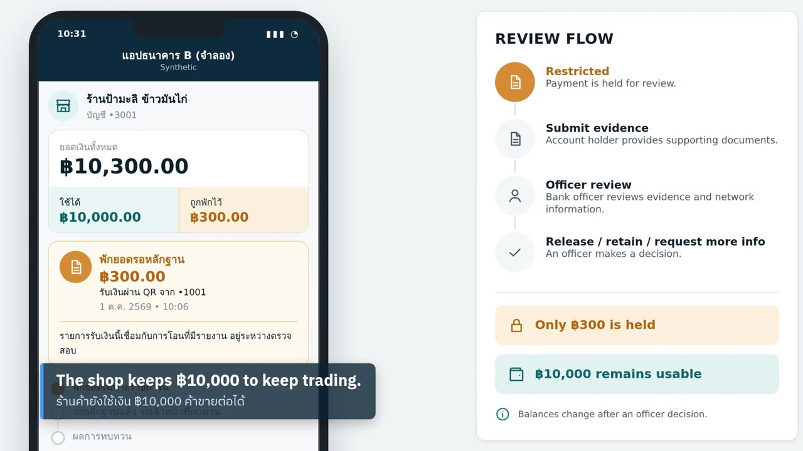

# คลิปเดโม ทันเงิน (THAN NGERN)



**วิดีโอ:** [`final_demo.mp4`](final_demo.mp4) · 1920×1080 · 30fps · H.264 + AAC · ยาว 39.3 วินาที · ~14 MB
**ข้อความหลัก:** *Stop the mule money — not the innocent merchant.* / หยุดเงินม้า ไม่ใช่หยุดร้านค้าบริสุทธิ์
**ผู้ชม:** กรรมการ NITMX Fintech Bootcamp 2026

| ไฟล์ | คืออะไร |
|---|---|
| [`final_demo.mp4`](final_demo.mp4) | คลิปตัดต่อเสร็จแล้ว มีคำบรรยายไทย/อังกฤษฝังในภาพ ดนตรีประกอบ และเสียงคลิก |
| [`captions_en.srt`](captions_en.srt) · [`captions_th.srt`](captions_th.srt) | ไฟล์คำบรรยายแยก (เวลาตรงกับคลิป) |
| [`EDL.md`](EDL.md) | edit decision list: ช่วงเวลาในคลิปแต่ละช่วงมาจากเวลาไหนของไฟล์ต้นฉบับ พร้อมพิกัด crop/zoom |
| [`source_capture.mp4`](source_capture.mp4) | ไฟล์อัดหน้าจอต้นฉบับ (2940×1600) ที่ EDL อ้างถึง |

## ลำดับฉาก

| เวลา | ฉาก | คำบรรยาย (EN / TH) |
|---|---|---|
| 0:00 | Landing hero → ซูมเข้า diagram | Scam money moves from bank to crypto in minutes. / เงินจากมิจฉาชีพไหลจากธนาคารสู่คริปโตในไม่กี่นาที |
| 0:03 | การ์ด "The ฿300 merchant payment" | Banks see baht. Exchanges see crypto. Nobody sees the whole path. |
| 0:05.5 | Bank A transaction feed (เร่ง 3×) | A victim's ฿50,000 is split across mule accounts within minutes. |
| 0:08.5 | Our Engine: CASE-0001 → กราฟ → คะแนน 0.85 + เหตุผล | ทันเงิน links bank, exchange and chain into one explainable case. |
| 0:15 | Bank B: คลิก Restrict ฿300 only → Held ฿300 | The officer holds only the suspicious ฿300, not the whole account. |
| 0:19.5 | Merchant: พัก ฿300 / ใช้ได้ ฿10,000 | The shop keeps ฿10,000 to keep trading. |
| 0:22.5 | Merchant: ส่งหลักฐานแล้ว → Officer review | The shop sends evidence from its banking app. |
| 0:25.5 | Officer console: คลิก Release this hold | A bank officer reviews and decides. Humans stay in control. |
| 0:28.5 | Merchant: ปลดการพักยอดแล้ว ใช้ได้ ฿10,300 | Released. The full ฿10,300 is usable again. |
| 0:31.5 | Overview (ถอยกล้องออก) | Every party sees one shared, explainable case. |
| 0:34.3 | End card: โลโก้ทันเงิน + tagline | Stop the mule money — not the innocent merchant. |

ตัวเลขในคลิปมีแค่ตัวเลขที่ปรากฏบนหน้าจอเว็บ (฿50,000, ฿16,000, ฿300, ฿10,000, ฿10,300, 0.85, CASE-0001) คลิปไม่ได้อ้างว่าหยุดการถอนคริปโตได้ และข้อมูลทั้งหมดเป็นข้อมูลจำลอง

## ที่มาของภาพและเสียง

- **ภาพ:** อัดจากเว็บต้นแบบ [FreezingH2O/itmx-prototype-demo](https://github.com/FreezingH2O/itmx-prototype-demo) (commit `47ef53f`) ที่รันในเครื่อง ตอนอัดใช้ชื่อและโลโก้ทันเงินแทนชื่อเดิม "ทางเชื่อม" ในเว็บ (สลับในเบราว์เซอร์ขณะอัด ไม่ได้แก้โค้ดเว็บ) โลโก้อยู่ใน [`assets/`](assets/)
- **คำบรรยาย:** ฟอนต์ IBM Plex Sans Thai บนแถบสี navy #0A2232 80% มีแถบสี #4A9FF5 ด้านซ้าย
- **เสียง:** ดนตรีบรรเลง ~100 BPM สร้างด้วยโค้ดทั้งหมด (`scripts/music.py`) ไม่มีปัญหาลิขสิทธิ์ ค่อย ๆ build ขึ้นจนถึง end card และจังหวะลงตรงกับการตัดเข้า end card ส่วนเสียงคลิกเบา ๆ ตรงกับการกดปุ่มในภาพ ไม่มีเสียงพากย์

## สร้างคลิปใหม่

ต้องมี Python 3.11 (Pillow, numpy, scipy), Node 22 (`playwright-core`), ffmpeg และ Chromium และต้องรันเว็บต้นแบบไว้ที่ `127.0.0.1:5173` (API ที่ `:8000`) วางไฟล์ใน `assets/` ไว้ข้างสคริปต์ และวางฟอนต์ `@fontsource/ibm-plex-sans-thai` ไว้ใน `fonts/`

```bash
node scripts/capture.mjs          # อัดต้นฉบับ → src_frames/ + capture.json (marks, clicks)
python3 scripts/edit.py plan      # เตรียมข้อความคำบรรยาย
node scripts/render_text.mjs      # เรนเดอร์คำบรรยาย + end card ด้วย Chromium (ฟอนต์ Plex Thai)
python3 scripts/edit.py render    # ตัดต่อ → video_only.mp4, captions_*.srt, edl.md, out_cues.json
python3 scripts/music.py          # ดนตรี + เสียงคลิก → soundtrack.wav
ffmpeg -i video_only.mp4 -i soundtrack.wav -c:v copy -c:a aac -b:a 192k -shortest -movflags +faststart final_demo.mp4
```
